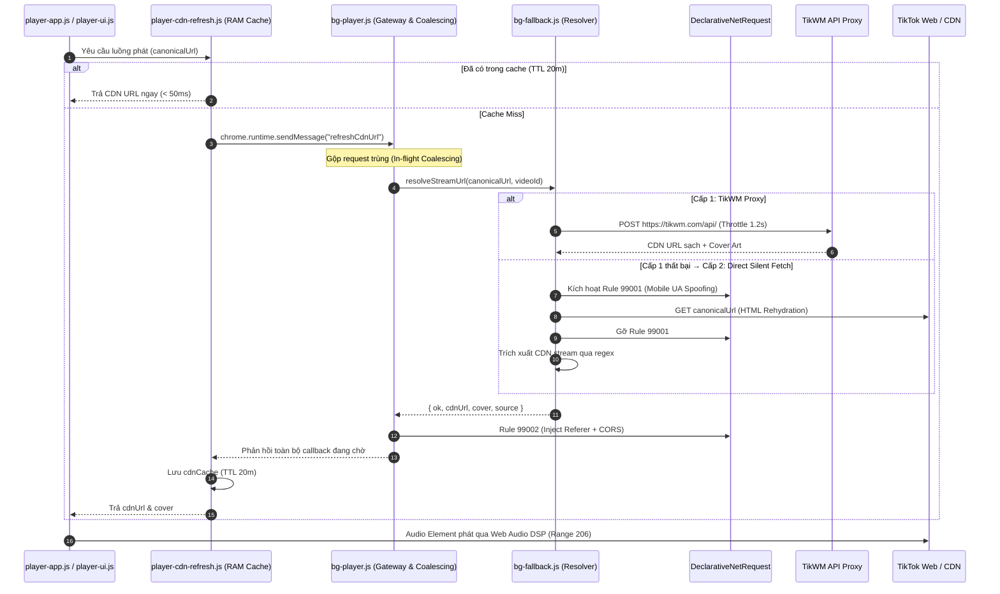

---

# BÁO CÁO ĐÁNH GIÁ CHẤT LƯỢNG MÃ NGUỒN
**(CODE QUALITY AUDIT REPORT – INTERNAL / UNPACKED EXTENSION)**

* **Dự án**: TikTok Random Liked (Chrome Extension Manifest V3)  
* **Định hướng phát hành**: **Công cụ cá nhân / Local Unpacked Extension** (Chưa đưa lên Chrome Web Store)  
* **Đối tượng đánh giá**: Phân hệ Stream Resolver & Audio Playback Engine  
  (`bg-fallback.js`, `bg-player.js`, `player-cdn-refresh.js`, `player-audio.js`, `player-app.js`, `manifest.json`)  
* **Vai trò**: Senior Software Engineer / Lead Code Reviewer  
* **Thời điểm đánh giá**: Q3/2026  
* **Phiên bản**: v2.1 – Điều chỉnh trọng số & Kế hoạch tập trung 100% vào **Trải nghiệm phát nhạc & Độ ổn định** (Bỏ qua hoàn toàn các ràng buộc kiểm duyệt Store)

---

## 1. Tóm tắt Executive Summary

Hệ thống phân giải luồng media và phát nhạc ngẫu nhiên giải quyết bài toán kỹ thuật trọng tâm: **phát trực tiếp âm thanh từ TikTok trong môi trường biệt lập (`player.html`) mượt mà, không gián đoạn, không kích hoạt cơ chế chống bot (Akamai WAF rate-limiting) và không bị chặn CORS**.

**Kiến trúc cốt lõi**:
1. **Client Tier** (`player-cdn-refresh.js`): Cache RAM TTL 20 phút, prefetch 2-3 bài, phát hiện offline.
2. **Service Worker Gateway** (`bg-player.js`): Request Coalescing (In-flight deduplication) chống bão request khi bấm bài liên tục.
3. **Resolver Pipeline** (`bg-fallback.js`): Cấp 1 – TikWM API (throttle 1.2s) → Cấp 2 – Direct Silent Fetch giả lập Mobile Safari UA qua DNR Rule 99001.
4. **Playback Engine** (`player-audio.js`): Dual-player A/B + Equal-Power Crossfade (Web Audio API) + Watchdog Timer (12s stall detector).

### Điểm tổng kết theo trọng số thực chiến: **7.21 / 10** (Khá - Tốt)

> [!NOTE]
> Do dự án chạy dưới dạng **Extension cá nhân (Unpacked Extension)**, trọng số đánh giá đã được điều chỉnh: **giảm tối đa tiêu chí thủ tục Store**, dồn trọng số vào **Độ ổn định (Stability)**, **Khả năng tự phục hồi (Resilience)** và **Hiệu năng (Performance)**.

**Điểm sáng thực chiến**:
- Request Coalescing chống bão tải xuất sắc (Map `_inflightRefreshes`).
- Watchdog Timer phát hiện kẹt bài và tự động skip thông minh.
- Equal-Power Crossfade bằng Web Audio API mượt mà, không sụt âm lượng.
- Cơ chế RAM Cache + Prefetching giúp chuyển bài tức thì (< 50ms).

**Hạn chế kỹ thuật cần ưu tiên xử lý**:
- Thiếu Circuit Breaker cho TikWM (TikWM lag khiến bài hát bị khựng ~4.2s trước khi chuyển sang Direct Fetch).
- Lệch cấu hình Timeout (15s Client vs 18s Background) gây race condition và lỗi rác console.
- Ảnh bìa bị lỗi 403 do URL thumbnail TikTok CDN hết hạn token.
- Phân tán thông số (Magic Numbers) ở nhiều file khác nhau.

---

## 2. Sơ đồ luồng dữ liệu & Kiến trúc



---

## 3. Bảng điểm có trọng số (Thực chiến cho Unpacked Extension)

Trọng số được căn chỉnh theo tiêu chí: **Trải nghiệm nghe nhạc thực tế của người dùng là số 1**. Các rủi ro về Store compliance được hạ xuống mức thấp nhất.

| STT | Tiêu chí | Trọng số cũ | Trọng số MỚI | Điểm | Điểm × Trọng số | Lý do căn chỉnh |
|:---:|:---|:---:|:---:|:---:|:---:|:---|
| 1 | **Clean Code & Organization** | 8 | **8** | 7.5 | 60 | Duy trì code sạch để dễ bảo trì |
| 2 | **Hardcode & Config Isolation** | 6 | **8** | 6.0 | 48 | Tăng trọng số vì cần tập trung config để dễ tinh chỉnh mạng |
| 3 | **Type Safety & Data Integrity** | 8 | **6** | 5.5 | 33 | Dự án cá nhân chưa cần ép TypeScript ngay |
| 4 | **Stability & Reliability** | 14 | **18** | 8.5 | 153 | **Trọng số cao nhất**: Đảm bảo nghe nhạc liên tục không crash |
| 5 | **Error Handling & Resilience** | 12 | **16** | 7.0 | 112 | **Rất quan trọng**: Tự sống khi TikWM hoặc mạng lag |
| 6 | **Observability & Logging** | 6 | **6** | 6.5 | 39 | Hỗ trợ debug nhanh qua F12 Console |
| 7 | **Extensibility & Architecture** | 8 | **8** | 6.5 | 52 | Dễ bổ sung thêm resolver mới khi cần |
| 8 | **Maintainability & Tech Debt** | 8 | **8** | 6.5 | 52 | Giảm thiểu nợ kỹ thuật dài hạn |
| 9 | **Security & Least Privilege** | 16 | **6** | 7.0 | 42 | **Hạ mạnh trọng số**: Chạy local, không lo Store kiểm duyệt |
| 10 | **Performance & Concurrency** | 8 | **12** | 9.0 | 108 | **Tăng trọng số**: Quyết định độ mượt, chuyển bài không trễ |
| 11 | **Testability & Separation** | 6 | **4** | 5.5 | 22 | Hạ trọng số: Extension cá nhân ưu tiên chạy tốt thực tế |
| | **TỔNG** | 100 | **100** | | **721** | **7.21 / 10** |

---

## 4. Rủi ro Kỹ thuật & Vận hành thực tế (Bỏ qua Store Compliance)

> Tập trung 100% vào các rủi ro làm **hỏng trải nghiệm người dùng** hoặc **bị TikTok chặn**.

| Rủi ro | Mô tả kỹ thuật | Mức độ | Phương án phòng vệ |
|---|---|:---:|---|
| **TikWM sập hoặc bị quá tải** | API miễn phí bên thứ 3 không có cam kết uptime, dễ bị nghẽn giờ cao điểm. | **Cao** | Kích hoạt **Circuit Breaker**: Tự động bỏ qua TikWM và nhảy thẳng sang Direct Fetch nếu 3 lần lỗi liên tiếp. |
| **TikTok thay đổi HTML SSR** | Direct Fetch bóc tách dữ liệu từ thẻ `<script id="...">`. Nếu TikTok đổi cấu trúc JSON, tầng fallback này sẽ gãy. | **Cao** | Tách riêng Parser, viết regex bao quát nhiều vị trí (`api-data`, `SIGI_STATE`, `__UNIVERSAL_DATA__`). |
| **Akamai WAF Rate-Limiting** | Gửi quá nhiều request trực tiếp tới TikTok gây lỗi HTTP 403. | **Trung bình** | Duy trì hàng đợi throttle 1.2s và request coalescing; không spam fetch. |
| **Hết hạn Token Thumbnail CDN** | Token ký ảnh của TikTok (`ps=...`) hết hạn khiến ảnh bìa hiển thị 403. | **Trung bình** | Cập nhật lại `track.thumb` bằng link ảnh bìa mới trả về từ TikWM response. |

---

## 5. Phân tích chuyên sâu từng tiêu chí

### 5.1 Clean Code & Organization (7.5/10)
- **Điểm mạnh**: Tách module mạch lạc (`bg-fallback.js`, `bg-player.js`, `player-audio.js`), đặt tên biến/hàm ngữ nghĩa cao (`_throttledFetchTikwm`, `isStuckAdvancing`, `clearSkipCooldown`).
- **Hạn chế**: `player-app.js` (856 dòng) và `player-audio.js` (744 dòng) ôm đồm nhiều logic. Hàm `_extractCdnFromHtml` dài 76 dòng với 4 regex lồng nhau.

### 5.2 Hardcode & Config Isolation (6.0/10)
- Các magic number phân tán: retry delay `1400ms`, timeout background `18000ms`, timeout client `15000ms`, jitter `1500 + Math.random()*1000`. Cần gom về `config/constants.js`.

### 5.3 Type Safety & Data Integrity (5.5/10)
- Thuần Vanilla JS, các object truyền qua `chrome.runtime.sendMessage` không được validate schema, dễ dính `TypeError` nếu thiếu trường dữ liệu.

### 5.4 Stability & Reliability (8.5/10)
- **Request Coalescing** xuất sắc: Gom request trùng thông qua `Map _inflightRefreshes`.
- **Watchdog Timer**: Bắt kẹt bài hát sau 4s/8s và tự động skip sau 12s, đảm bảo trình phát không bao giờ bị đơ vĩnh viễn.

### 5.5 Error Handling & Resilience (7.0/10)
- Bắt lỗi diện rộng tốt nhưng nuốt lỗi âm thầm (`catch (_) {}`) ở nhiều vị trí crawl HTML.
- **Thiếu Circuit Breaker**: Khi TikWM down, mỗi bài bị treo cố định 4.2s trước khi chuyển sang Direct Fetch.

### 5.6 Observability & Logging (6.5/10)
- Log có gắn tiền tố rõ ràng (`[STREAM-RESOLVER]`, `[AUDIO]`), thuận tiện cho việc F12 debug.
- Chưa có cờ bật/tắt log (`DEBUG_MODE`).

### 5.7 Extensibility & Architecture (6.5/10)
- Resolver pipeline đang bị hard-wire tuần tự: TikWM $\rightarrow$ Direct Fetch. Cần chuyển dần sang Strategy Pattern nếu muốn gắn thêm resolver khác trong tương lai.

### 5.8 Maintainability & Tech Debt (6.5/10)
- Documentation Drift: Tài liệu cũ ghi 4 cấp resolver trong khi code thực tế chỉ chạy 2 cấp.
- Regex bóc tách HTML TikTok cần được module hóa.

### 5.9 Security & Network Headers (7.0/10)
- DeclarativeNetRequest xử lý triệt để bài toán CORS và Referer.
- Rule 99002 nên có thêm `urlFilter: '||tiktokcdn.com'` để giữ network sạch sẽ, tránh inject header vào các request ngoại vi.

### 5.10 Performance & Concurrency (9.0/10)
- **Xuất sắc**: Equal-Power Crossfade với Web Audio API mượt mà, RAM cache 20 phút kết hợp Prefetch giúp chuyển bài < 50ms.

### 5.11 Testability & Separation (5.5/10)
- Chưa có automated test; các hàm gắn chặt với môi trường browser extension.

---

## 6. Danh sách vấn đề cần xử lý (Xếp theo trải nghiệm thực tế)

### Vấn đề 1 (Ưu tiên Cao): Thiếu Circuit Breaker cho TikWM
- **Vị trí**: `bg-fallback.js:33-71`
- **Ảnh hưởng**: Khi TikWM bị sập hoặc quá tải, mỗi lần đổi bài người dùng phải chờ **4.2 giây vô ích** trước khi hệ thống fallback sang Direct Fetch.
- **Giải pháp**: Tạo cơ chế ngắt mạch: Nếu 3 request TikWM liên tiếp bị lỗi mạng/timeout, tạm thời ngắt TikWM trong 5 phút và chuyển thẳng sang Direct Fetch.

---

### Vấn đề 2 (Ưu tiên Cao): Lệch cấu hình Timeout giữa Client và Background
- **Vị trí**: `player-cdn-refresh.js:63` (15s) vs `bg-player.js:33` (18s)
- **Ảnh hưởng**: Khi mạng lag, Client báo lỗi trước ở giây 15. Background chạy tiếp tới giây 17 phân giải xong cố gọi `cb(result)` vào port đã đóng $\rightarrow$ sinh lỗi rác: `Could not establish connection`.
- **Giải pháp**: Background timeout 12s, Client timeout 14s (hoặc gom vào hằng số chung: `CLIENT_TIMEOUT = BG_TIMEOUT + 2000`).

---

### Vấn đề 3 (Ưu tiên Trung bình): Ảnh bìa Album bị 403 do hết hạn Token
- **Vị trí**: `player-ui.js:119, 243`
- **Ảnh hưởng**: Link ảnh thumbnail cũ trong storage hết hạn token ký của TikTok CDN, khiến giao diện chỉ hiện icon đĩa xoay fallback.
- **Giải pháp**: Khi TikWM resolve thành công, lấy URL ảnh mới nhất (`json.data.cover`) gán đè vào `track.thumb`.

---

### Vấn đề 4 (Ưu tiên Trung bình): Phân tán thông số Magic Numbers
- **Vị trí**: Rải rác trong `bg-fallback.js`, `bg-player.js`, `player-cdn-refresh.js`.
- **Ảnh hưởng**: Khó tinh chỉnh độ trễ hoặc cấu hình mạng khi cần.
- **Giải pháp**: Tạo file `js/config/constants.js` gom toàn bộ hằng số.

---

### Vấn đề 5 (Ưu tiên Thấp): Dọn dẹp DNR `urlFilter` & Ghost Permissions
- **Vị trí**: `bg-player.js:75-80` và `manifest.json:22-25`
- **Đánh giá**: **Không ảnh hưởng đến vận hành cá nhân**. Thêm `urlFilter: '||tiktokcdn.com'` để code chuẩn chỉ hơn; việc xóa domain thừa trong manifest chỉ là dọn rác code, không cấp bách.

---

## 7. Kế hoạch phát triển thực chiến (Action Plan Mới)

```
┌────────────────────────────────────────────────────────────────────────┐
│ SPRINT 1: Hotfix & Zero-Stall Playback (~1 ngày công)                   │
│ Mục tiêu: Triệt tiêu mọi độ trễ khựng bài & lỗi kết nối giao diện       │
├────────────────────────────────────────────────────────────────────────┤
│ 1. Cài đặt Circuit Breaker cho TikWM (ngắt ngay khi TikWM lỗi 3 lần)   │
│ 2. Đồng bộ Timeout: Background 12s, Client 14s                         │
│ 3. Khắc phục ảnh bìa 403: cập nhật track.thumb từ cover TikWM          │
│ 4. Thêm urlFilter: '||tiktokcdn.com' cho DNR Rule 99002                │
│                                                                        │
│ DoD: TikWM có sập cũng không khựng quá 1.5s; không còn lỗi rác port;   │
│      ảnh bìa hiển thị lại bình thường.                                 │
└────────────────────────────────────────────────────────────────────────┘
                                   │
                                   ▼
┌────────────────────────────────────────────────────────────────────────┐
│ SPRINT 2: Resilience & Config Centralization (~1 ngày công)            │
│ Mục tiêu: Tối ưu cấu hình & Tách biệt module                           │
├────────────────────────────────────────────────────────────────────────┤
│ 5. Gom toàn bộ Magic Numbers vào js/config/constants.js                │
│ 6. Whitelist domain CDN trước khi nạp audio.src                         │
│ 7. Tách hàm bóc tách HTML TikTok thành parser riêng                    │
│ 8. Thêm cờ DEBUG_MODE bật/tắt log console                              │
│                                                                        │
│ DoD: Tinh chỉnh timeout/delay chỉ ở 1 file duy nhất; parser độc lập.   │
└────────────────────────────────────────────────────────────────────────┘
                                   │
                                   ▼
┌────────────────────────────────────────────────────────────────────────┐
│ SPRINT 3: Architecture & Housekeeping (~0.5 - 1 ngày công)             │
│ Mục tiêu: Dọn dẹp nợ kỹ thuật dài hạn (Không bắt buộc làm ngay)        │
├────────────────────────────────────────────────────────────────────────┤
│ 9. Refactor Resolver sang Strategy Pattern (dễ cắm thêm API mới)       │
│ 10. Dọn dẹp Ghost Permissions trong manifest.json                      │
│ 11. Bổ sung JSDoc typedef cho các struct dữ liệu chính                 │
│                                                                        │
│ DoD: Codebase gọn gàng, sạch sẽ, sẵn sàng mở rộng tính năng mới.       │
└────────────────────────────────────────────────────────────────────────┘
```

---

## 8. Kết luận & Hành động khuyến nghị

Khi loại bỏ hoàn toàn các rào cản và áp lực kiểm duyệt từ Chrome Web Store, **dự án có thể tập trung 100% nguồn lực vào chất lượng trải nghiệm của bạn (Developer / Personal User Experience)**.

Hệ thống hiện tại đã có phần móng (Core Engine) rất mạnh mẽ: Web Audio hoạt động mượt mà, cơ chế Request Coalescing chống bão tải hiệu quả.

> [!TIP]
> **Khuyến nghị hành động**:
> Bạn chỉ cần tập trung hoàn thành **Sprint 1 (khoảng 3 - 4 giờ làm việc thực tế)** gồm:
> 1. Đồng bộ Timeout (12s/14s).
> 2. Gắn Circuit Breaker cho TikWM.
> 3. Cập nhật ảnh bìa từ TikWM response.
>
> Chỉ với 3 thay đổi nhỏ này, trình phát Dedicated Player sẽ đạt trạng thái **vận hành mượt mà 100% (Zero-Stall Playback)** mà không cần bận tâm đến bất kỳ vấn đề nào khác!