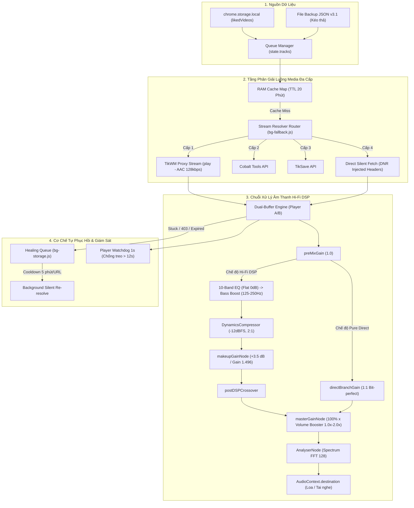

# TikTok Random Liked

Chrome Extension hỗ trợ **thu thập video từ danh sách TikTok đã thích** và **phát ngẫu nhiên các video đã thu thập**.

README này mô tả kiến trúc kỹ thuật, các engine chính, cơ chế điều khiển, giới hạn và recovery của extension.

---

## 1. Architecture

Extension được chia thành hai engine chính:

```text
┌──────────────────────┐
│       Popup UI       │
└──────────┬───────────┘
           │
           ▼
┌──────────────────────────────────────┐
│           Background / SW            │
│                                      │
│  Collection Job Manager              │
│  Playback Manager                   │
│  Tab / Error Watchdog                │
└─────────────┬────────────────────────┘
              │
       Chrome Message API
              │
      ┌───────┴────────┐
      ▼                ▼
┌──────────────┐ ┌──────────────────┐
│ Collection   │ │ Playback Engine  │
│ Content      │ │ Content Scripts  │
└──────────────┘ └──────────────────┘
```

### Collection Engine

Chịu trách nhiệm:

* Cuộn trang TikTok Liked.
* Phát hiện và thu thập URL video.
* Thu thập thumbnail.
* Theo dõi tiến trình.
* Dừng khi đạt điều kiện.
* Checkpoint dữ liệu.
* Cleanup DOM để giảm tải.
* Recovery khi tab hoặc content script gặp lỗi.

### Playback Engine

Chịu trách nhiệm:

* Chọn video ngẫu nhiên.
* Theo dõi trạng thái `<video>`.
* Tự động chuyển video.
* Bỏ qua video lỗi hoặc không phù hợp.
* Phục hồi video bị pause/stuck.
* Theo dõi trạng thái tab.

---

# 2. Collection Engine

## 2.1 Target Limit

Số lượng video cần thu thập được xác định bởi:

```text
targetLimit
```

Giá trị mặc định từ Popup là `100`.

Phiên collection kết thúc khi số lượng video mới thu thập đạt target:

```text
newCollectedCount >= targetLimit
```

Giới hạn số lần cuộn tối đa:

```text
maxScrolls = ceil((existingCount + targetLimit) / 10) + 15
```

Điều này giúp giới hạn thời gian chạy trong trường hợp trang không thể cung cấp thêm dữ liệu.

---

## 2.2 Collection Stopping Conditions

Collection Engine có nhiều điều kiện dừng độc lập.

### Smart Stop

Được sử dụng khi thực hiện **Quét video mới**.

```text
smartStop = true
```

Engine theo dõi các video đã tồn tại trong `existingUrlsSet`.

Nếu phát hiện video cũ trong **3 batch liên tiếp**, collection được kết thúc sớm.

Đối với chế độ **Quét tiếp**, `smartStop` được tắt để tiếp tục thu thập dữ liệu.

### No-New Detection

Theo dõi số lần cuộn nhưng không phát hiện video mới:

```text
noNewCount
```

Nếu:

```text
noNewCount >= 4
```

engine coi trang không còn dữ liệu mới và dừng collection.

**Đặc biệt (Catch-Up Phase)**: Khi đang cuộn qua vùng video đã biết ở chế độ quét tiếp (`isCatchingUp = true`), bộ đếm `noNewCount` được đóng băng bằng `0` để tránh dừng sớm trước khi tiếp cận vùng video mới thực sự.

### Scroll Height Detection

Theo dõi:

```text
scrollHeight
```

Nếu chiều cao trang không thay đổi trong 5 lần cuộn liên tiếp:

```text
sameHeightCount >= 5
```

engine kết luận đã chạm đáy hoặc trang không tiếp tục load dữ liệu.

---

# 3. Collection Performance

## 3.1 Dynamic Scroll Delay

Thời gian chờ giữa các lần scroll được điều chỉnh dựa trên trạng thái collection.

Khi số lượng video tăng:

| Điều kiện                  | Delay bổ sung |
| -------------------------- | ------------: |
| `collectedMap.size > 800`  |        +400ms |
| `collectedMap.size > 1500` |        +800ms |
| `collectedMap.size > 2500` |       +1500ms |

Nếu thumbnail chưa load kịp:

```text
missingThumbQueue.size > 5
```

thêm `600ms` delay và chuyển trạng thái sang:

```text
slow_network
```

**Fast Catch-Up Mode**:
Trong giai đoạn Catch-Up (`isCatchingUp = true`), độ trễ giữa các lần cuộn được giảm đáng kể xuống còn **300–500ms** ngẫu nhiên. Đồng thời, hệ thống bỏ qua việc giải mã và lưu thumbnail của video cũ nhằm tối ưu hóa CPU và RAM. Khi vượt qua vùng dữ liệu cũ, hệ thống tự động quay lại thời gian chờ nguyên bản (700–1300ms + delay bổ sung).

---

## 3.2 DOM Rest

Sau mỗi 100 lần scroll:

```text
itemsSinceLastRest >= 100
```

engine tạm nghỉ:

```text
2500ms
```

Mục đích là giảm áp lực CPU/RAM trong các phiên collection dài.

*Lưu ý*: Giai đoạn Catch-Up (`isCatchingUp = true`) bỏ qua trạng thái nghỉ này để hoàn tất bắt kịp dữ liệu cũ nhanh nhất có thể.

---

## 3.3 DOM Cleanup

Khi số lượng video card trên DOM vượt quá:

```text
200 items
```

extension giữ lại khoảng:

```text
150 items
```

và loại bỏ các card cũ hơn để tránh quá tải bộ nhớ trình duyệt (hữu ích cho các phiên chạy dài >2 tiếng).

Dữ liệu cần thiết như URL và thumbnail được trích xuất hoàn tất vào `collectedMap` và đồng bộ qua checkpoint (`saveCheckpointData`) trước khi DOM node bị xóa thực sự, nhằm đảm bảo không thất thoát dữ liệu.

---

# 4. Checkpoint & Recovery

## 4.1 Checkpoint

Collection Engine lưu trạng thái tạm thời vào:

```text
chrome.storage.local
└── checkpoint
```

Checkpoint được cập nhật:

* Mỗi `10s`
* Hoặc khi có thêm `30` video mới.

Khi collection hoàn tất thành công:

```text
clearCheckpoint()
```

được gọi để xóa trạng thái tạm.

---

## 4.2 Final Sweep

Sau khi kết thúc collection, engine thực hiện một lần sweep cuối:

```text
scrollBy(0, -300)
```

Sau đó chờ:

```text
2000ms
```

để các thumbnail hoặc dữ liệu còn pending có cơ hội được load và thu thập.

---

# 5. Collection Job Manager

Background Service Worker chịu trách nhiệm điều phối collection job.

### Job Timeout

Mỗi collection job có timeout:

```text
20s
```

Nếu job không phản hồi đúng thời gian, background thực hiện retry bằng cách điều hướng tab về profile và chạy lại job.

### Content Script Health Check

Background gửi:

```text
ping
```

mỗi:

```text
2000ms
```

để kiểm tra content script còn hoạt động trước khi gửi command collection.

### Error Page Recovery (403 / Access Denied / WAF Blocks)

Các trạng thái như:

```text
403
Access Denied
Forbidden
Just a Moment (WAF challenge)
```

được phát hiện từ `tab.title` hoặc `url` của tab (kể cả chrome-error/edge-error).

Thay vì reload cứng hoặc gọi lại liên tiếp, background áp dụng **Tiered Cooldown (Exponential Backoff)** để phòng chống bot-detection:

* **1st block (Liên tiếp lần 1)**: Cooldown **10s** (tạm nghỉ trước khi hồi phục).
* **2nd block (Liên tiếp lần 2)**: Cooldown **20s** (tăng thời gian nghỉ).
* **3rd block (Liên tiếp lần 3+)**: Deep sleep **65s** và gửi Toast cảnh báo lên màn hình người dùng.
* Bộ đếm liên tiếp tự động reset về `0` sau **5 phút** hoạt động bình thường không gặp lỗi.

Đồng thời, Watchdog của background áp dụng **đệm trễ 1.8s (Anti-Stampeding delay)** trước khi can thiệp điều hướng để tránh xung đột hoặc tranh chấp với các luồng tự phục hồi nội tại của Content Script (SPA navigation `navigateToVideo` luôn được ưu tiên hàng đầu).

---

# 6. Playback Engine

Playback Engine sử dụng danh sách video đã collection để thực hiện random playback.

## 6.1 Auto Next

Trạng thái được lưu trong:

```text
chrome.storage.local
└── autoNextEnabled
```

Nếu:

```text
autoNextEnabled = false
```

extension không tự động chuyển sang video tiếp theo.

---

## 6.2 Video Loop Control

Extension theo dõi `<video>` element và quản lý thuộc tính:

```html
<video loop>
```

`MutationObserver` được sử dụng để phát hiện khi thuộc tính `loop` bị thay đổi và khôi phục trạng thái cần thiết.

Khi video gần kết thúc:

```text
duration - currentTime < 0.5s
```

engine:

1. Remove `loop`
2. Pause video
3. Gửi `playNext` tới Background
4. Background chọn video tiếp theo

Event `ended` được sử dụng như cơ chế fallback nếu `loop` bị mất.

---

# 7. Video Selection

Video được chọn thông qua:

```text
selectRandomVideo()
```

Các video bị loại khỏi candidate list:

* Video nằm trong `blacklistedVideos`
* Video hiện tại

Engine ưu tiên các video chưa xuất hiện trong:

```text
playedVideos
```

Khi toàn bộ danh sách đã được phát:

```text
playedVideos = []
```

được reset để bắt đầu một vòng playback mới.

---

# 8. Playback Throttling

Content script đảm bảo khoảng cách tối thiểu giữa hai lần request chuyển video:

```text
>= 2000ms
```

Background sử dụng delay ngẫu nhiên trước khi thực hiện một số thao tác chuyển video:

| Action     |         Delay |
| ---------- | ------------: |
| Auto next  | `1500–3500ms` |
| Skip       |  `800–2000ms` |
| Ban & next |  `500–1500ms` |

Mục đích chính là tránh các thao tác chuyển tiếp xảy ra liên tục và giúp playback flow ổn định hơn.

---

# 9. Video Error Detection

Playback Engine có nhiều lớp phát hiện lỗi.

## 9.1 Stuck Video

Video được kiểm tra định kỳ mỗi:

```text
1s
```

Nếu `currentTime` gần như không thay đổi:

* **Giây thứ 4**: Ghi nhận log chẩn đoán `STUCK` nội bộ.
* **Giây thứ 5**: Kích hoạt **Soft Recovery** (`load()` + `currentTime = 0.05` + `play()`) để đánh thức video bị đơ.
* **Giây thứ 6**: Coi video là stuck thực sự và thực hiện skip chuyển sang video tiếp theo.

---

## 9.2 TikTok Shop / Muted Video

Sau khi video load khoảng:

```text
2500ms
```

extension kiểm tra các dấu hiệu:

* TikTok Shop
* Audio bị mute do vấn đề bản quyền
* Các keyword được cấu hình trong `MUTED_SOUND_KEYWORDS`

Nếu phát hiện, video sẽ được skip sau khoảng:

```text
2200ms
```

---

# 10. Playback Recovery

## Video Auto Resume

Extension kiểm tra video định kỳ:

```text
1500ms
```

Nếu video bị `paused` ngoài dự kiến, engine tự động gọi `video.play()` để khôi phục playback.

## "Please Wait" Recovery

Kiểm tra overlay định kỳ:

```text
4000ms
```

Nếu trạng thái `"Please Wait"` (hoặc các lớp overlay modal lỗi khác) xuất hiện và tồn tại kéo dài quá **12 giây**, hệ thống kích hoạt **Chuỗi phục hồi mềm (Phase A-D)**:

* **Phase A**: Cuộn nhẹ lên/xuống ($\pm 50\text{px}$) để ép trình duyệt tính toán lại layout.
* **Phase B**: Dispatch các sự kiện focus/visibility giả để đánh thức renderer của tab.
* **Phase C**: Tạm chờ thêm **5 giây** xem lỗi có tự biến mất không.
* **Phase D**: Nếu vẫn bị kẹt sau Phase A-C, chuyển sang video tiếp theo thông qua cơ chế SPA navigation (`requestNextVideo`).

## 403 / Blank Page

Nếu phát hiện:

```text
403
Access Denied
Blank Page
```

extension gửi event:

```text
handle403Detected
```

để thực hiện playback recovery.

---

# 11. Background Watchdog

Background Service Worker chạy watchdog định kỳ:

```text
3000ms
```

Watchdog theo dõi:

* Tab bị 403.
* Tab hiển thị trang trắng.
* Content script không phản hồi.
* Video tab không phản hồi trong thời gian cho phép.

Khi phát hiện trạng thái bất thường, background có thể khởi động lại playback bằng cách chọn video mới.

---

# 12. Background / Visibility Handling

Extension có một nhóm cơ chế nhằm duy trì trạng thái playback khi tab không ở foreground.

Các lớp hiện có:

### Layer 1 — Visibility

Theo dõi và xử lý:

```text
document.hidden
document.visibilityState
visibilitychange
```

### Layer 2 — Focus

Theo dõi:

```text
document.hasFocus()
blur
focus
```

và thực hiện các hành vi resume cần thiết.

### Layer 3 — Navigator State

Điều chỉnh một số thuộc tính navigator được sử dụng để xác định môi trường trình duyệt.

### Web Audio Keep-Alive

Sử dụng một `AudioContext` với gain rất thấp nhằm duy trì hoạt động của browser process trong một số trường hợp tab chạy nền.

### Layer 4 — Activity Simulation

Tạo các hoạt động trình duyệt định kỳ như:

```text
mousemove
pointermove
scroll
```

với khoảng thời gian không cố định.

### Layer 5 — Telemetry Handling

Theo dõi các request telemetry liên quan đến các endpoint được cấu hình trong extension.

Các cơ chế này được triển khai trong:

```text
js/content-bypass.js
```

---

# 13. Storage

Các trạng thái chính được lưu trong:

```text
chrome.storage.local
```

| Key                 | Purpose                        |
| ------------------- | ------------------------------ |
| `likedVideos`       | Danh sách video đã thu thập    |
| `playedVideos`      | Video đã phát                  |
| `blacklistedVideos` | Video bị loại                  |
| `checkpoint`        | Trạng thái collection tạm thời |
| `autoNextEnabled`   | Trạng thái auto next           |

---

# 14. Main Parameters

| Parameter           |                                 Giá trị | Vai trò                        |
| ------------------- | --------------------------------------: | ------------------------------ |
| `targetLimit`       |                          `100` mặc định | Số video mục tiêu              |
| `maxScrolls`        | `ceil((existing + targetLimit)/10) + 15` | Giới hạn scroll                |
| `noNewCount`        |                                     `4` | Dừng khi không có video mới    |
| `sameHeightCount`   |                                     `5` | Dừng khi page height không đổi |
| `smartStop`         |                            `true/false` | Dừng khi gặp dữ liệu cũ        |
| Checkpoint interval |                                   `10s` | Lưu progress                   |
| Checkpoint batch    |                             `30 videos` | Lưu progress                   |
| DOM rest            |                           `100 scrolls` | Nghỉ giảm tải                  |
| DOM rest delay      |                                `2500ms` | Thời gian nghỉ                 |
| Collection timeout  |                                   `20s` | Job timeout                    |
| Ping interval       |                                `4500ms` | Trễ kiểm tra trước khi ping    |
| Stuck timeout       |                                     `6s` | Phát hiện video đứng (stuck)   |
| Watchdog interval   |                                `3000ms` | Giám sát playback              |
| Cooldown Tier 1     |                                   `10s` | Phục hồi lỗi 403 lần 1         |
| Cooldown Tier 2     |                                   `20s` | Phục hồi lỗi 403 lần 2 liên tiếp |
| Cooldown Tier 3     |                                   `65s` | Phục hồi lỗi WAF lần 3+ liên tiếp |

---

# 15. High-Level Flow

## Collection

```text
User
 │
 ▼
Popup
 │
 ▼
Start Collection
 │
 ▼
Background Job Manager
 │
 ▼
Content Script
 │
 ├── Scan video cards
 ├── Extract URL
 ├── Extract thumbnail
 ├── Save collection
 ├── Check stopping conditions
 ├── Cleanup DOM
 └── Save checkpoint
 │
 ▼
Final Sweep
 │
 ▼
Collection Completed
```

## Playback

```text
User
 │
 ▼
Playback Request
 │
 ▼
Background
 │
 ├── Filter blacklist
 ├── Filter current video
 ├── Filter played videos
 └── Select random video
 │
 ▼
Random Delay
 │
 ▼
TikTok SPA Navigation
 │
 ▼
Content Video Controller
 │
 ├── Monitor video
 ├── Resume playback
 ├── Detect stuck
 ├── Detect invalid video
 └── Detect end
 │
 ▼
playNext
 │
 └──────────────► Background
```

---

# 16. Source Structure

Các module chính liên quan đến hai engine:

```text
popup.js
│
├── User controls
└── Collection configuration

background.js
│
├── Global watchdog
└── Background coordination

bg-collections.js
│
└── Collection Job Manager

bg-playback.js
│
└── Playback Manager

content.js
│
└── Playback messaging / page integration

js/
├── content-core.js
│   └── Collection engine
│
├── content-checkpoint.js
│   └── Checkpoint / DOM cleanup / final sweep
│
├── content-video.js
│   └── Video monitoring / playback recovery
│
└── content-bypass.js
    └── Background / visibility handling
```

---

# 17. Design Principles

Extension được xây dựng xoay quanh các nguyên tắc:

1. **Collection có giới hạn** — luôn có target và nhiều stopping criteria.
2. **Không phụ thuộc một điều kiện dừng duy nhất** — sử dụng nhiều tín hiệu để tránh collection chạy vô hạn.
3. **Progress có thể phục hồi** — checkpoint giúp hạn chế mất dữ liệu khi job bị gián đoạn.
4. **DOM được kiểm soát** — tránh giữ quá nhiều video card trong DOM.
5. **Playback có watchdog** — video và tab đều được giám sát.
6. **Error recovery tự động** — các trạng thái stuck, 403, blank page và loading bất thường đều có hướng xử lý.
7. **Playback không lặp video trong cùng một cycle** — sử dụng `playedVideos` để quản lý vòng phát.
8. **Background chịu trách nhiệm điều phối** — content script tập trung xử lý logic trực tiếp trên trang.

---

## 18. Summary

Có thể xem hệ thống gồm các pipeline độc lập nhưng liên kết chặt chẽ:

```text
TikTok Liked
     │
     ▼
┌───────────────┐
│ Collection    │
│ Engine        │
└───────┬───────┘
        │
        ▼
  likedVideos (chrome.storage.local / JSON Backup v3.1)
        │
   ┌────┴────────────────────────┐
   ▼                             ▼
┌───────────────┐        ┌───────────────────────┐
│ Web Playback  │        │ TikTok Hi-Fi Studio   │
│ Engine (Tab)  │        │ Dedicated Player      │
└───────┬───────┘        └───────────┬───────────┘
        │                            │
        ▼                            ▼
 Random Playback               Dual-Buffer DSP
        │                            │
        ▼                            ▼
 Recovery / Watchdog          Healing Queue & JIT Cache
```

**Collection Engine** tối ưu cho việc thu thập dữ liệu có kiểm soát và có khả năng tiếp tục/recovery.

**Playback Engine** tối ưu cho việc lựa chọn, phát, chuyển tiếp và phục hồi video trên tab TikTok.

**TikTok Hi-Fi Dedicated Player** tối ưu cho việc nghe nhạc ngầm độc lập với chất lượng âm thanh Hi-Fi cao cấp, xử lý DSP chuyên nghiệp và bảo vệ chống lỗi 403 tuyệt đối.

---

# 19. TikTok Hi-Fi Dedicated Player & Audio DSP Architecture

Trình phát chuyên dụng ([`player.html`](file:///d:/A.Myself/Random-Video/player.html)) là môi trường phát nhạc độc lập, tách rời hoàn toàn khỏi tab duyệt web TikTok nhằm triệt tiêu 100% rủi ro WAF 403 và tiết kiệm tài nguyên hệ thống.



---

## 19.1 Tầng Phân Giải Luồng Media (Stream Resolution Hierarchy)

Để đảm bảo thẻ `<audio>` trong Extension phát được $100\%$ video mà không bị chặn bởi Akamai WAF hoặc chính sách CORS:
1. **Cấp 1 — TikWM Proxy Stream (`json.data.play`)**: Phương án ưu tiên số 1. Trả về luồng proxy nguyên vẹn âm thanh gốc **AAC 128kbps** của video, thời gian phân giải siêu tốc ($200 - 300\text{ ms}$), mở sẵn `Access-Control-Allow-Origin: *` và miễn nhiễm hoàn toàn với lỗi 403.
2. **Cấp 2 — Cobalt API**: Dịch vụ giải mã dự phòng chất lượng cao, trích xuất luồng media độc lập.
3. **Cấp 3 — TikSave API**: Cầu nối dự phòng bổ sung khi các dịch vụ trên quá tải.
4. **Cấp 4 — Direct TikTok CDN (JIT Silent Fetch)**: Phân giải trực tiếp từ HTML rehydration của TikTok, được hỗ trợ bởi quy tắc **DNR Rule 99002** tự động chèn `Referer: https://www.tiktok.com/` và `Origin: https://www.tiktok.com` vào mọi request media từ extension.
5. **Bộ nhớ đệm RAM Cache**: Lưu trữ tạm link CDN và trạng thái nguồn trong RAM (`CDN_CACHE_TTL_MS = 20 * 60 * 1000`), giúp tua lại bài cũ với độ trễ $0\text{ ms}$ và hỗ trợ tải trước (Prefetch) 3 bài kế tiếp.

---

## 19.2 Chuỗi Xử Lý Âm Thanh Hi-Fi DSP (Web Audio Graph)

Chuỗi âm thanh trong [`player-audio.js`](file:///d:/A.Myself/Random-Video/js/player/player-audio.js) được tối ưu hóa toàn diện theo các nguyên lý phòng thu:
* **Master Volume Khởi Tạo 100% (`1.0`)**: Triệt tiêu mức suy hao $-2.85\text{ dB}$, đồng bộ lưu sở thích âm lượng qua `localStorage.getItem('tiktok_player_volume')`.
* **Preset EQ Mặc Định Trung Tính (`Flat`)**: Cả 10 dải tần (32Hz đến 16kHz) đặt tại $0\text{ dB}$, bảo toàn trọn vẹn dải cao $>15\text{ kHz}$ và headroom âm học.
* **Bộ Nén DynamicsCompressor & Makeup Gain (+3.5 dB)**:
  - Cấu hình: `threshold: -12 dBFS`, `ratio: 2:1`, `knee: 15 dB`, `attack: 10 ms`, `release: 200 ms`.
  - Tích hợp `makeupGainNode` ($+3.5\text{ dB}$, `gain.value = 1.496`) ngay sau compressor giúp loại bỏ hoàn toàn hiện tượng sụt âm và tiếng bơm giật (pumping).
* **Bộ Chuyển Đổi Chế Độ Âm Thanh (Segmented Sound Mode)**:
  - **`[ Hi-Fi DSP ]`**: Kích hoạt chuỗi xử lý đầy đặn với EQ 10 dải, Bass Boost ấm $125 - 250\text{ Hz}$ và Volume Normalizer.
  - **`[ Pure Direct ]`**: Chuyển luồng tín hiệu qua `directBranchGain`, bỏ qua $100\%$ DSP để nghe âm mộc nguyên bản $1:1$.
* **Volume Booster 4 Mức**: Hỗ trợ khuếch đại $1.0\times$ (Chuẩn), $1.25\times$ (+2 dB), $1.5\times$ (+3.5 dB), $2.0\times$ (+6 dB) có tích hợp soft-limiter chống vỡ tiếng.

---

## 19.3 Dual-Buffer Playback & Crossfade A/B

* **Kiến trúc 2 kênh A/B**: Sử dụng 2 phần tử `new Audio()` song song (`playerA` và `playerB`). Kênh active nhận tải toàn bộ âm lượng, kênh idle được nạp ngầm bài kế tiếp ở mốc 85% thời lượng.
* **Chuyển bài mượt mà (Crossfade)**: Tự động fade-out kênh cũ đồng thời fade-in kênh mới trong $2.5\text{ giây}$ mà không xuất hiện khoảng lặng ngắt quãng.
* **Watchdog 1s**: Quét định kỳ mỗi 1 giây; nếu phát hiện trình phát bị đứng quá 12 giây sẽ tự động kích hoạt chuyển bài an toàn.

---

## 19.4 Quản Lý Danh Sách & Virtual Scroll Playlist

* **Virtual Scroll**: Chỉ render $20 - 30$ thẻ bài hát thực tế trong viewport kết hợp đệm padding, giúp giữ mức tiêu thụ RAM ổn định quanh $100 - 130\text{ MB}$ ngay cả khi nạp danh sách chứa hơn $3.000+$ video.
* **Event Delegation**: Sử dụng một Event Listener duy nhất tại container cha `#playlist` thay vì gắn listener độc lập cho từng thẻ bài.

---

## 19.5 Healing Queue — Cơ Chế Tự Phục Hồi Video Lỗi

* **Ghi nhận sự cố**: Khi một bài hát gặp sự cố (link CDN hết hạn, playback stalled, 403), player gửi action `enqueueForHealing` về Background.
* **Rate-Limit Chống Spam**: Áp dụng bảng theo dõi `recentlyEnqueuedHealing` với thời gian giãn cách **5 phút** cho mỗi URL canonical, ngăn chặn việc spam hàng đợi hồi sinh.
* **Tự Động Làm Mới**: Background Service Worker thực hiện làm mới URL CDN ngầm có giới hạn (`HEALING_MAX_RETRIES`). Khi thành công, trạng thái chuyển sang `healed` và tự động cập nhật cache mà không gián đoạn trải nghiệm nghe của người dùng.

