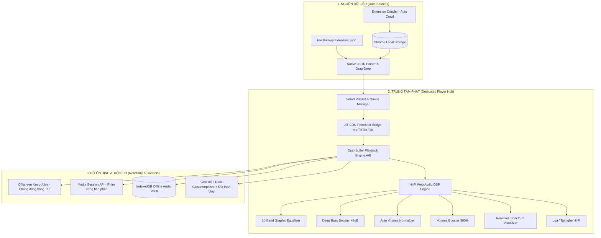

# 🎵 TikTok Hi-Fi Dedicated Player — Master Architecture & Engineering Roadmap

> **Tài liệu Kỹ thuật & Kế hoạch Thi công Tối ưu (Master Specification)**  
> **Dự án**: TikTok Random Liked Extension (Chrome MV3)  
> **Tính năng cốt lõi**: Trình phát đa phương tiện Hi-Fi chuyên dụng (`player.html`), tích hợp Web Audio DSP, cơ chế chống link CDN hết hạn JIT, chống đóng băng tab bằng Offscreen Document, và hỗ trợ độc quyền định dạng JSON backup của extension.

---

## 1. Tầm Nhìn & Bối Cảnh Chuyển Đổi



### Tại sao mô hình Trình phát riêng là tối ưu nhất?
1. **Triệt tiêu 100% nguy cơ WAF 403 & Captcha**: Không liên tục chuyển trang hay reload trên web app chính của TikTok.
2. **Siêu nhẹ & Tiết kiệm 90% CPU/RAM**: Loại bỏ toàn bộ DOM rác, quảng cáo, live-stream và tracking scripts của TikTok web.
3. **Chất lượng âm thanh phòng thu**: Trang bị đầy đủ Equalizer 10 dải tần, Bass Boost, cân bằng âm lượng tự động và khuếch đại 300%.
4. **Không lo link CDN bị chết**: Ứng dụng cơ chế *Just-In-Time (JIT) Refresher* để lấy link tươi khi chuẩn bị phát.

---

## 2. Chuẩn Dữ Liệu & Cơ Chế Đọc File JSON Của Extension

Trình phát tập trung **100% vào định dạng JSON backup chuẩn của extension**, đảm bảo tính đồng nhất tuyệt đối giữa Crawler, Storage và Player.

### 2.1. Cấu trúc File JSON của Extension
```json
{
  "version": "3.1",
  "exportAt": 1787050000000,
  "tiktokUsername": "@taochamhoi",
  "targetLimit": 100,
  "videoCount": 2,
  "blacklistedCount": 0,
  "likedVideos": [
    {
      "url": "https://www.tiktok.com/@oo_o01o0/video/7646241652096404754",
      "thumb": "https://p16-common-sign.tiktokcdn-us.com/..."
    },
    {
      "url": "https://www.tiktok.com/@taochamhoi/video/7669701007969946888",
      "thumb": "https://p19-common-sign.tiktokcdn-us.com/..."
    }
  ],
  "blacklistedVideos": [
    "https://www.tiktok.com/@spammer/video/1111111111111111111"
  ]
}
```

### 2.2. Logic Xử Lý & Chuẩn Hóa Dữ Liệu (Native JSON Parser)
* **Nguyên tắc bất di bất dịch**: Chỉ lưu trữ bền vững **Canonical URL** (`https://www.tiktok.com/@username/video/ID`). **Tuyệt đối không lưu URL CDN `.mp4` vào file JSON hoặc Storage lâu dài** vì token CDN sẽ hết hạn sau 12–24h.
* **Bộ chuyển đổi dữ liệu khi nạp vào Player**:
```javascript
/**
 * Chuẩn hóa danh sách video từ file JSON backup của Extension
 */
function parseExtensionBackup(data) {
  if (!data || !Array.isArray(data.likedVideos)) {
    throw new Error("File JSON không hợp lệ: Thiếu mảng likedVideos");
  }

  const blacklist = new Set((data.blacklistedVideos || []).map(u => u.split("?")[0]));

  return data.likedVideos
    .filter(item => {
      const url = typeof item === "string" ? item : item.url;
      return url && !blacklist.has(url.split("?")[0]);
    })
    .map((item, index) => {
      const url = (typeof item === "string" ? item : item.url).split("?")[0];
      const thumb = typeof item === "object" ? item.thumb || "" : "";
      
      const idMatch = url.match(/\/video\/(\d+)/);
      const userMatch = url.match(/@([^/?#]+)/);

      return {
        id: idMatch ? idMatch[1] : `vid_${index}`,
        canonicalUrl: url,
        thumb: thumb,
        username: userMatch ? `@${userMatch[1]}` : "@tiktok",
        title: `TikTok Video #${index + 1}`,
        duration: 0
      };
    });
}
```

---

## 3. Các Trụ Cột Kỹ Thuật Cốt Lõi (Core Technical Pillars)

### 🏛️ Trụ Cột 1: JIT CDN Refresher Bridge (Chống 403 & Hết Hạn Link)
* **Vấn đề**: URL CDN `.mp4` của TikTok chứa chữ ký bảo mật (`x-expires`, `x-signature`) tự vô hiệu hóa sau 12-24h.
* **Giải pháp JIT**:
  1. Player gửi yêu cầu `refreshCdnUrl({ canonicalUrl })` tới Background.
  2. Background sử dụng tab TikTok đang mở (có sẵn session cookies) thông qua `content-cdn-bridge.js` để trích xuất link `<video src>` tươi mới nhất.
  3. Trả link CDN tươi về cho Player và lưu đệm trong RAM (Memory Cache) với TTL ngắn (10-15 phút).
  4. Nếu gặp lỗi 403 giữa chừng: Tự động vô hiệu hóa cache, refresh lại 1 lần; nếu vẫn lỗi thì tự động chuyển sang video tiếp theo mà không làm treo hàng đợi.

### 🏛️ Trụ Cột 2: Hi-Fi Web Audio DSP & Dual-Buffer Crossfade (A/B)
* **Chuyển bài không khoảng lặng (Dual-Buffer Crossfade)**:
  * Sử dụng 2 phần tử phát song song (Player A và Player B).
  * Khi bài A đạt **85% thời lượng**, Player B tự động kích hoạt JIT Refresh lấy link bài kế tiếp và tải đệm trước.
  * Khi bài A kết thúc, GainNode của A giảm dần (Fade-out 2s) đồng thời GainNode của B tăng dần (Fade-in 2s) $\rightarrow$ Trải nghiệm nghe nhạc liền mạch như DJ.
* **10-Band Graphic Equalizer & Presets**:
  * Cần gạt 10 dải tần (`32Hz` đến `16kHz`).
  * **Deep Bass Boost (+9dB)**: Sử dụng bộ lọc `LowShelf` tại 60Hz - 150Hz tạo lực đánh căng tròn cho nhạc Dance/Remix/Vinahouse.
  * **Vocal Clear (+4dB)**: Đẩy dải 1kHz - 4kHz làm rõ lời ca sĩ.
  * **Lofi Chill**: Giảm bớt dải chói tai, tăng độ ấm (Warmth).
* **Auto Volume Normalization & Booster 300%**:
  * Tự động cân bằng mức âm thanh giữa các video bằng `DynamicsCompressorNode`.
  * Khuếch đại tối đa 300% cho các video ghi âm nhỏ bằng `GainNode`.

### 🏛️ Trụ Cột 3: Chống Đóng Băng Tab (Offscreen Keep-Alive)
* **Vấn đề**: Tính năng *Memory Saver* của trình duyệt Chrome sẽ tự động đình chỉ/đóng băng các tab chạy ngầm sau một khoảng thời gian.
* **Giải pháp**: Sử dụng API **Chrome Offscreen Document** (`offscreen.html`) chạy một vòng lặp âm thanh cực nhỏ để duy trì `AudioContext` liên tục, đảm bảo nghe nhạc không bao giờ bị ngắt khi chuyển sang làm việc ở ứng dụng khác.

### 🏛️ Trụ Cột 4: Két Lưu Trữ Nhạc Offline (IndexedDB Audio Vault)
* Cho phép người dùng bấm **"Tải Offline"** bài hát yêu thích.
* Dữ liệu nhị phân (Media Blob) được lưu vào **IndexedDB** của trình duyệt theo khóa `canonicalUrl`.
* Khi phát: Ưu tiên phát trực tiếp từ IndexedDB (`blob:...`), nghe mượt mà ngay cả khi ngắt kết nối Internet.

### 🏛️ Trụ Cột 5: Điều Khiển Đồng Bộ & Media Session API
* **Media Session API**:
  * Tích hợp phím cứng đa phương tiện trên bàn phím (Play/Pause, Next, Prev).
  * Hiển thị thông tin bài hát, tác giả và ảnh bìa trên thanh thông báo âm lượng của Windows.
* **Đồng bộ 2 chiều**:
  * Bấm **🚫 Cấm video (Ban)** ngay trên Player sẽ tự động cập nhật vào `blacklistedVideos` trong `chrome.storage.local` để Crawler không quét lại.

---

## 4. Thiết Kế Giao Diện (UI/UX Dark Glassmorphism)

```
+-----------------------------------------------------------------------------------+
|  🎵 TIKTOK HI-FI STUDIO    [🔍 Tìm kiếm bài hát / kênh...]    [📁 Nhập JSON] [⚙️ EQ]  |
+-----------------------------------------------------------------------------------+
|  [ KHU VỰC PHÁT TRUNG TÂM ]         |  [ HÀNG ĐỢI & DANH SÁCH PHÁT ]              |
|                                     |                                             |
|  +-------------------------------+  |  #1  [Thumb] @oo_o01o0 - Video #1      [▶]  |
|  |                               |  |  #2  [Thumb] @taochamhoi - Video #2    [▶]  |
|  |     TIKTOK MEDIA / VINYL      |  |  #3  [Thumb] @music_vn - Video #3      [▶]  |
|  |   (Đĩa than Vinyl xoay tròn   |  |  #4  [Thumb] @remix_hot - Video #4     [▶]  |
|  |    hoặc Khung Video dọc)      |  |  ...                                        |
|  |                               |  |                                             |
|  +-------------------------------+  |  [+ Tải Offline]  [🚫 Cấm]  [💾 Xuất Backup]|
|                                     |                                             |
|  Now Playing: @oo_o01o0             +---------------------------------------------+
|  ~~~~~~~~~~~~~~~~~~~~~~~~~~~~~~~~~  |  [ EQUALIZER & BASS BOOST ]                 |
|  [ 01:14 ] ======●======== [ 03:20 ]|  | Preset: [ Bass Boost ⚡ v ] Boost: [+9dB] |
|  [ ▂▃▅▆▇  Realtime Visualizer  ]    |  | | | | | | | | | | (10 Cần gạt tần số)    |
+-------------------------------------+---------------------------------------------+
|  [🔀 Shuffle]  [⏮️ Prev]  [⏯️ PLAY]  [⏭️ Next]  [🔁 Loop All]  [🔊 =======●] [📺 PiP] |
+-----------------------------------------------------------------------------------+
```

---

## 5. Cấu Trúc Thư Mục & File Mã Nguồn Dự Kiến

```
Random-Video/
├── player.html                    # Giao diện chính của Trình phát
├── style-player.css               # Giao diện Dark Glassmorphism
├── offscreen.html                 # Trang ẩn duy trì âm thanh chạy ngầm
├── js/
│   ├── player/
│   │   ├── player-app.js          # Khởi tạo giao diện, Queue, Drag-Drop JSON
│   │   ├── player-audio.js        # Web Audio DSP, 10-Band EQ, Bass Boost, Crossfade
│   │   ├── player-cdn-refresh.js  # Client giao tiếp lấy link JIT CDN
│   │   ├── player-visualizer.js   # Vẽ sóng âm thanh Canvas Spectrum
│   │   ├── player-offline.js      # Quản lý lưu trữ IndexedDB Audio Vault
│   │   └── player-keepalive.js    # Giao tiếp với Offscreen Document
│   ├── background/
│   │   ├── bg-storage.js          # Đồng bộ dữ liệu Storage & Blacklist
│   │   └── bg-playback.js         # Message router & JIT Bridge coordinator
│   └── content/
│       └── content-cdn-bridge.js  # Script chạy trên tiktok.com để trích xuất link tươi
```

---

## 6. Lộ Trình Triển Khai 5 Giai Đoạn (DP-1 đến DP-5)

### 📌 Giai đoạn DP-1: Nền tảng Core UI + JIT CDN Refresher (Ưu tiên cao nhất)
* **Nhiệm vụ**:
  1. Tạo `player.html` + `player-app.js` + `style-player.css`.
  2. Xây dựng bộ đọc Storage và khu vực **kéo thả file JSON backup của Extension**.
  3. Xây dựng `content-cdn-bridge.js` và kênh thông điệp `refreshCdnUrl` qua Background để bóc tách link CDN tươi.
* **Tiêu chí nghiệm thu**: Kéo thả file JSON của bạn vào là nạp được danh sách; bấm Play là tự lấy link CDN tươi và phát được video/audio.

### 📌 Giai đoạn DP-2: Web Audio DSP Engine & Dual-Buffer Crossfade
* **Nhiệm vụ**:
  1. Thiết lập `AudioContext`, kết nối bộ lọc 10-Band Graphic EQ, Bass Boost (+9dB), Auto Normalizer (Compressor), Volume Booster 300%.
  2. Triển khai cấu chế 2 Player (A/B) với cơ chế Crossfade chuyển bài mượt mà không khoảng lặng tại mốc 85% thời lượng.
* **Tiêu chí nghiệm thu**: Âm thanh phát ra dày, bass đập sâu; chuyển bài êm ái không có tiếng ngắt đột ngột.

### 📌 Giai đoạn DP-3: Visualizer Sóng Nhạc & Offscreen Keep-Alive
* **Nhiệm vụ**:
  1. Vẽ đồ họa phổ sóng âm thanh chuyển động theo nhịp bass trên thẻ `<canvas>`.
  2. Tạo `offscreen.html` và module `player-keepalive.js` để ngăn Chrome đóng băng tab khi người dùng chuyển sang tab khác.
* **Tiêu chí nghiệm thu**: Ẩn tab hoặc thu nhỏ trình duyệt trong 15 phút, nhạc vẫn phát liên tục không bị dừng; sóng nhạc nhảy đều theo điệu bass.

### 📌 Giai đoạn DP-4: Két Lưu Trữ Nhạc Offline (IndexedDB Vault)
* **Nhiệm vụ**:
  1. Xây dựng module `player-offline.js` quản lý IndexedDB lưu trữ nhị phân media blob.
  2. Thêm nút *"Tải Offline"* trên từng bài hát trong hàng đợi.
* **Tiêu chí nghiệm thu**: Tải offline 1 bài $\rightarrow$ ngắt mạng WiFi $\rightarrow$ bài hát vẫn phát bình thường từ bộ nhớ đệm.

### 📌 Giai đoạn DP-5: Bảng Điều Khiển Hợp Nhất & Media Session API
* **Nhiệm vụ**:
  1. Tích hợp `navigator.mediaSession` để điều khiển bằng phím cứng bàn phím.
  2. Thêm nút *"🎵 Mở Trình Phát Hi-Fi"* trên `popup.html` của extension.
  3. Hoàn thiện tính năng Cấm vĩnh viễn (Ban) đồng bộ 2 chiều về Storage.
* **Tiêu chí nghiệm thu**: Bấm phím Media trên bàn phím để Next/Pause; hiển thị ảnh bìa trên thanh volume Windows; bấm mở Player từ popup mượt mà 1-click.

---

## 7. Bảng Kiểm Soát Rủi Ro & Khắc Phục (Risk Register)

| Rủi ro kỹ thuật | Mức độ | Cơ chế khắc phục |
|---|---|---|
| Link CDN `.mp4` bị hết hạn sau 12h | Cao | Chỉ lưu Canonical URL; dùng cơ chế JIT Refresher lấy link tươi khi chuẩn bị phát. |
| Chrome đóng băng tab khi ẩn (Memory Saver) | Cao | Duy trì luồng audio bằng **Chrome Offscreen Document**. |
| Quá tải số lần mở tab lấy link CDN | Trung bình | Tái sử dụng tab TikTok đang mở; cache link CDN trong RAM 15 phút. |
| Âm lượng các video không đều nhau | Trung bình | Dùng `DynamicsCompressorNode` để tự động san bằng dải động âm thanh. |
| Dung lượng lưu trữ Offline đầy | Thấp | Báo lỗi thân thiện khi vượt dung lượng IndexedDB; cho phép xoá từng bài riêng lẻ. |

---

*Tài liệu này là bản đặc tả kỹ thuật hoàn chỉnh và chính thức nhất để tiến hành lập trình từng bước.*
