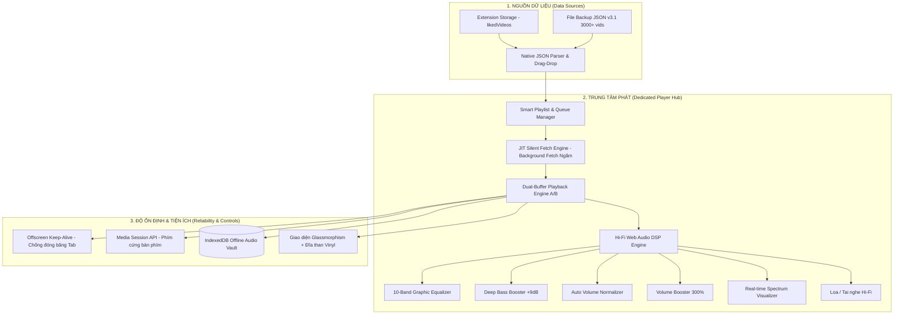

# 🎵 TikTok Hi-Fi Dedicated Player — Master Architecture & Engineering Roadmap (v2)

> **Tài liệu Kỹ thuật & Kế hoạch Thi công Tối ưu hóa - Bản cập nhật Phát nhạc Ẩn danh (v2)**  
> **Dự án**: TikTok Random Liked Extension (Chrome MV3)  
> **Trạng thái**: Đã sửa đổi điểm mâu thuẫn (Loại bỏ hoàn toàn yêu cầu mở Tab TikTok)  
> **Tính năng cốt lõi**: Trình phát đa phương tiện Hi-Fi chuyên dụng (`player.html`), tích hợp Web Audio DSP, cơ chế trích xuất CDN ngầm (Silent Fetch Engine), chống đóng băng tab bằng Offscreen Document, và hỗ trợ độc quyền định dạng JSON backup v3.1 của extension.

---

## 1. Tầm Nhìn & Bối Cảnh Chuyển Đổi (Bản Sửa Đổi)



### Tại sao mô hình Trình phát riêng và Chạy ngầm là tối ưu nhất?
1. **Triệt tiêu 100% nguy cơ WAF 403 & Captcha**: Hoàn toàn không tự động mở tab mới, không liên tục chuyển trang hay tải lại trang web chính trước mắt người dùng.
2. **Siêu nhẹ & Tiết kiệm 95% CPU/RAM**: Không render hình ảnh video TikTok, không nạp script quảng cáo, live-stream hay các bộ theo dõi (tracking) của TikTok Web. Chỉ tải mã nguồn HTML thuần dưới dạng text và giải mã duy nhất luồng âm thanh.
3. **Chất lượng âm thanh phòng thu**: Trang bị đầy đủ Equalizer 10 dải tần, Bass Boost, cân bằng âm lượng tự động (Dynamics Compressor) và khuếch đại lên tới 300%.
4. **Không lo link CDN bị chết**: Ứng dụng cơ chế *Just-In-Time (JIT) Silent Fetch Refresher* để lấy link nhạc mới ngay khi chuẩn bị chuyển bài mà không cần tương tác với DOM.

---

## 2. Chuẩn Dữ Liệu & Cơ Chế Đọc File JSON Của Extension (Hỗ trợ v3.1)

Trình phát tập trung **100% vào định dạng JSON backup v3.1 của extension**, hỗ trợ trực tiếp kho lưu trữ 3.000+ video hiện có của người dùng mà không cần nạp lại dữ liệu.

### 2.1. Cấu trúc File JSON của Extension (v3.1)
```json
{
  "version": "3.1",
  "exportAt": 1787050000000,
  "tiktokUsername": "@taochamhoi",
  "targetLimit": 100,
  "videoCount": 2,
  "blacklistedCount": 0,
  "likedVideos": [
    {
      "url": "https://www.tiktok.com/@oo_o01o0/video/7646241652096404754",
      "thumb": "https://p16-common-sign.tiktokcdn-us.com/..."
    },
    {
      "url": "https://www.tiktok.com/@taochamhoi/video/7669701007969946888",
      "thumb": "https://p19-common-sign.tiktokcdn-us.com/..."
    }
  ],
  "blacklistedVideos": [
    "https://www.tiktok.com/@spammer/video/1111111111111111111"
  ]
}
```

### 2.2. Logic Xử Lý & Chuẩn Hóa Dữ Liệu (Native JSON Parser)
* **Nguyên tắc bất di bất dịch**: Chỉ lưu trữ bền vững **Canonical URL** (`https://www.tiktok.com/@username/video/ID`). **Tuyệt đối không lưu URL CDN `.mp4` vào file JSON hoặc Storage lâu dài** vì chữ ký bảo mật (`x-expires`, `x-signature`) của Akamai sẽ hết hạn sau 12–24h.
* **Bộ chuyển đổi dữ liệu khi nạp vào Player**:
  * Sử dụng biểu thức chính quy Regex `/https:\/\/www\.tiktok\.com\/@([^\/]+)\/video\/(\d+)/` để tự động bóc tách **Username** (ví dụ: `@nhungcoem`) và **Video ID** từ chuỗi URL tĩnh.
  * Tự động gán ảnh bìa mặc định khi trường `thumb` bị trống để tránh lỗi vỡ UI.
  * Đọc mảng `blacklistedVideos` từ JSON và lưu trực tiếp vào danh sách đen của Player để lọc tự động trong hàng chờ.

```javascript
/**
 * Chuẩn hóa danh sách video từ file JSON backup của Extension (v3.1)
 */
function parseExtensionBackup(data) {
  if (!data || !Array.isArray(data.likedVideos)) {
    throw new Error("File JSON không hợp lệ: Thiếu mảng likedVideos");
  }

  const blacklist = new Set((data.blacklistedVideos || []).map(u => (typeof u === "string" ? u.split("?")[0] : "")));

  return data.likedVideos
    .filter(item => {
      const url = typeof item === "string" ? item : item.url;
      return url && !blacklist.has(url.split("?")[0]);
    })
    .map((item, index) => {
      const rawUrl = (typeof item === "string" ? item : item.url) || "";
      const cleanUrl = rawUrl.split("?")[0];
      const thumb = typeof item === "object" ? item.thumb || "" : "";
      
      const match = cleanUrl.match(/https:\/\/www\.tiktok\.com\/@([^/]+)\/video\/(\d+)/);
      const username = match ? `@${match[1]}` : "@tiktok";
      const videoId = match ? match[2] : `vid_${index}`;

      return {
        id: videoId,
        canonicalUrl: cleanUrl,
        thumb: thumb,
        username: username,
        title: `TikTok Video #${index + 1}`,
        duration: 0
      };
    });
}
```

---

## 3. Các Trụ Cột Kỹ Thuật Cốt Lõi (Core Technical Pillars - Sửa đổi v2)

### 🏛️ Trụ Cột 1: JIT Silent Fetch Engine (Trích Xuất CDN Ngầm Không Mở Tab)
* **Vấn đề của bản cũ**: Phụ thuộc vào việc mở tab TikTok hoặc tương tác với một tab TikTok đang mở của người dùng để tiêm content script lấy link `<video src>`. Khi tab bị ẩn hoặc đóng băng, cơ chế này bị tê liệt hoàn toàn.
* **Giải pháp cải tiến v2 (Silent Fetch)**:
  1. Khi chuẩn bị chuyển bài, `player.js` gửi tin nhắn `{ action: "GET_STREAM_URL", tiktokUrl }` tới Background Service Worker.
  2. Background sử dụng hàm `fetch()` để tải ngầm mã nguồn HTML của URL đó mà **không mở tab hay cửa sổ trình duyệt nào**. Trình duyệt sẽ tự động đính kèm Cookie session hiện tại của người dùng vào yêu cầu fetch ngầm để vượt qua bộ lọc bảo mật.
  3. Trích xuất trực tiếp đường dẫn phát âm thanh (CDN stream `.mp4`) từ mã nguồn HTML thông qua việc tìm kiếm cấu trúc JSON rehydration:
     * *Đường dẫn chính*: Đối tượng JSON bên trong `<script id="__UNIVERSAL_DATA_FOR_REHYDRATION__" type="application/json">` $\rightarrow$ `webapp.video-detail.itemInfo.itemStruct.video.playAddr`.
     * *Đường dẫn dự phòng*: Đối tượng JSON bên trong `<script id="SIGI_STATE" type="application/json">`.
  4. Trả link CDN tươi về cho Player và lưu đệm trong RAM với TTL ngắn (10–15 phút). Nếu gặp lỗi 403 giữa chừng, tự động bỏ qua và chuyển sang bài tiếp theo.

### 🏛️ Trụ Cột 2: Hi-Fi Web Audio DSP & Dual-Buffer Crossfade (A/B)
* **Chuyển bài không khoảng lặng (Dual-Buffer Crossfade)**:
  * Sử dụng 2 phần tử phát song song (Player A và Player B) dưới dạng các đối tượng Audio ngầm.
  * Khi bài A đạt **85% thời lượng**, Player B tự động kích hoạt *JIT Silent Fetch Engine* để lấy trước link CDN tươi của bài kế tiếp và tải đệm ngầm.
  * Khi chuyển bài, `GainNode` của Player A giảm dần (Fade-out 2s) đồng thời `GainNode` của Player B tăng dần (Fade-in 2s) tạo cảm giác liền mạch tuyệt đối.
* **10-Band Graphic Equalizer & Presets**:
  * Cần gạt 10 dải tần từ `32Hz` đến `16kHz` kết nối trực tiếp đến các `BiquadFilterNode`.
  * **Deep Bass Boost (+9dB)**: Áp dụng bộ lọc `LowShelf` tại dải tần 60Hz – 150Hz.
  * **Vocal Clear (+4dB)**: Tăng cường dải trung âm 1kHz – 4kHz.
  * **Lofi Chill**: Giảm bớt dải chói tai, tăng độ ấm tự nhiên.
* **Auto Volume Normalization & Booster 300%**:
  * Sử dụng `DynamicsCompressorNode` để san bằng biên độ dao động âm thanh giữa các bài nhạc.
  * Khuếch đại tối đa 300% bằng `GainNode` đối với các bản nhạc có mức âm lượng ghi âm quá nhỏ.

### 🏛️ Trụ Cột 3: Chống Đóng Băng Tab (Offscreen Keep-Alive)
* **Vấn đề**: Tính năng tiết kiệm tài nguyên trình duyệt (Memory Saver/Tab Hibernation) của Chrome tự động tắt luồng xử lý ngầm của tab `player.html` khi người dùng không tương tác trực tiếp.
* **Giải pháp**: Sử dụng API **Chrome Offscreen Document** (`offscreen.html`) chạy một vòng lặp âm thanh giả lập với biên độ cực nhỏ để duy trì luồng `AudioContext` luôn ở trạng thái hoạt động (Active), đảm bảo phát nhạc không bị ngắt quãng.

### 🏛️ Trụ Cột 4: Két Lưu Trữ Nhạc Offline (IndexedDB Audio Vault)
* Cho phép người dùng lưu trữ nhạc trực tiếp xuống bộ nhớ cục bộ bằng cách bấm **"Tải Offline"**.
* Tách lấy luồng dữ liệu nhị phân (Media Blob) và lưu vào **IndexedDB** của Extension (không giới hạn dung lượng như `chrome.storage.local`).
* Khi phát lại, trình phát ưu tiên đọc trực tiếp từ IndexedDB (`blob:chrome-extension://...`), loại bỏ hoàn toàn việc gửi yêu cầu lên mạng, giúp bảo mật tuyệt đối trước hệ thống quét của TikTok.

### 🏛️ Trụ Cột 5: Điều Khiển Đồng Bộ & Media Session API
* Tích hợp `navigator.mediaSession` để nhận các phím bấm đa phương tiện vật lý từ bàn phím (Play, Pause, Next, Prev) và hiển thị thông tin bài hát trên Widget điều khiển của hệ điều hành.
* Đồng bộ 2 chiều: Khi nhấn nút cấm (Ban) trên Player, URL của video sẽ lập tức được đẩy vào `blacklistedVideos` lưu trong storage để loại bỏ vĩnh viễn khỏi hàng chờ và thông báo cho bộ lọc.

---

## 4. Thiết Kế Giao Diện (UI/UX 4-Panel Glassmorphism)

Giao diện Studio được xây dựng trên hệ thống lưới CSS Grid 4 panel độc lập, đồng phẳng, loại bỏ hoàn toàn khung bọc trung gian:

```
+-----------------------------------------------------------------------------------------------------------------+
|                                           TIKTOK HI-FI STUDIO                                                  |
+-----------------------------+---------------------------------------------+-------------------------------------+
| 1. LIBRARY PANEL (Trái)     | 2. CENTER STAGE (Trung tâm)                 | 3. DSP PANEL (Phải)                 |
| - Header & Thống kê         | - Tiêu đề & Kênh tác giả                    | - Volume Normalizer                 |
| - Tabs (Playlist / Offline) | - Live Audio Visualizer (Vinyl / Spectrum)  | - Bass Boost Slider                 |
| - Ô tìm kiếm video          | - Đĩa than Vinyl quay đồng bộ theo beat     | - Crossfade Time Slider             |
| - Drop Zone nạp JSON v3.1   |                                             | - 10-Band Graphic EQ + Presets      |
| - Scrollable Track List     |                                             | - Ghi chú xử lý âm thanh            |
+-----------------------------+---------------------------------------------+-------------------------------------+
| 4. MEDIA BAR (Dưới cùng - Toàn chiều rộng)                                                                      |
| [Timeline Scrubber]                                                                                             |
| [Thumb + Info]    [🔀 Shuffle] [⏮️ Prev] [⏯️ PLAY/PAUSE] [⏭️ Next] [🔁 Loop] [🚫 Ban]    [01:23 / 03:45] [🔊 Volume]|
+-----------------------------------------------------------------------------------------------------------------+
```

---

## 5. Cấu Trúc Thư Mục & File Mã Nguồn

```
Random-Video/
├── player.html                    # Giao diện chính của Trình phát (Layout Grid 4 panel phẳng)
├── style-player.css               # Hệ thống Style Glassmorphism & Animations
├── offscreen.html                 # Trang ẩn duy trì âm thanh chạy ngầm (Offscreen Keep-Alive)
├── background.js                  # Service Worker: Xử lý JIT Silent Fetch ngầm
├── js/
│   └── player/
│       ├── player-app.js          # Khởi tạo giao diện, Queue, Drag-Drop JSON v3.1
│       ├── player-audio.js        # Web Audio DSP, 10-Band EQ, Bass Boost, Dual-Buffer Crossfade
│       ├── player-cdn-refresh.js  # Module Silent Fetch JIT kết nối Background
│       ├── player-visualizer.js   # Vẽ sóng âm thanh Canvas Spectrum & Animation đĩa than
│       ├── player-offline.js      # Quản lý lưu trữ IndexedDB Audio Vault
│       └── player-keepalive.js    # Giao tiếp với Offscreen Document
└── docs/
    └── Process-Dedicated-Player.md # Tài liệu kiến trúc & Kế hoạch triển khai (v2)
```

---

## 6. Lộ Trình Triển Khai 5 Giai Đoạn Cải Tiến (DP-1 đến DP-5)

### 📌 Giai đoạn DP-1: Nền tảng Core UI + Silent JIT Fetcher (Ưu tiên cao nhất)
* **Nhiệm vụ**:
  1. Xây dựng giao diện trình phát độc lập `player.html` kết hợp tệp CSS và JS xử lý giao diện 4-panel.
  2. Xây dựng khu vực kéo thả để đọc file JSON backup v3.1 chứa kho 3.000+ video đã thích của bạn và lưu vào `playlistCache` trong storage.
  3. Viết logic cho `background.js` lắng nghe thông điệp `GET_STREAM_URL` / `refreshCdnUrl`, thực hiện fetch ngầm trang TikTok và giải mã bóc tách link CDN (`.mp4`) trả về cho Player.
* **Tiêu chí nghiệm thu**: Kéo thả file JSON v3.1 hiện tại vào là nạp được danh sách; bấm Play là tự động lấy link CDN tươi ngầm 100% dưới nền và phát ra tiếng nhạc mà không mở bất kỳ tab TikTok nào.

### 📌 Giai đoạn DP-2: Web Audio DSP Engine & Dual-Buffer Crossfade
* **Nhiệm vụ**:
  1. Thiết lập `AudioContext`, kết nối bộ lọc 10-Band EQ, Bass Boost, Compressor và Booster 300%.
  2. Triển khai thuật toán chuyển bài mượt mà Crossfade (A/B) ở mốc 85% thời lượng.
* **Tiêu chí nghiệm thu**: Âm thanh dày, bass căng; chuyển bài êm ái không ngắt quãng.

### 📌 Giai đoạn DP-3: Visualizer Sóng Nhạc & Offscreen Keep-Alive
* **Nhiệm vụ**:
  1. Triển khai Canvas vẽ đồ thị tần số chuyển động theo điệu bass và animation đĩa than Vinyl.
  2. Tích hợp Offscreen Document API để duy trì luồng phát khi tab bị ẩn hoặc thu nhỏ.
* **Tiêu chí nghiệm thu**: Ẩn tab nghe nhạc 15+ phút không bị dừng; sóng nhạc nhảy mượt mà.

### 📌 Giai đoạn DP-4: Két Lưu Trữ Nhạc Offline (IndexedDB Vault)
* **Nhiệm vụ**:
  1. Hoàn thiện tính năng lưu trữ dữ liệu nhị phân xuống IndexedDB (`player-offline.js`).
  2. Hỗ trợ phát nhạc trực tiếp từ Blob URL ngoại tuyến không cần kết nối mạng.
* **Tiêu chí nghiệm thu**: Tải offline bài hát $\rightarrow$ ngắt mạng $\rightarrow$ phát trơn tru.

### 📌 Giai đoạn DP-5: Bảng Điều Khiển Hợp Nhất & Media Session API
* **Nhiệm vụ**:
  1. Liên kết phím cứng bàn phím và hệ điều hành qua `navigator.mediaSession`.
  2. Thiết lập nút tắt mở nhanh Player trên `popup.html` của extension.
  3. Đồng bộ danh sách cấm video (Ban) hai chiều về `chrome.storage.local`.
* **Tiêu chí nghiệm thu**: Phím Media bàn phím hoạt động chuẩn xác; đồng bộ blacklist tức thì.

---

## 7. Bảng Kiểm Soát Rủi Ro & Khắc Phục Cập Nhật (Risk Register v2)

| Rủi ro kỹ thuật | Mức độ | Cơ chế khắc phục cập nhật (v2) |
| :--- | :--- | :--- |
| **Link CDN `.mp4` bị hết hạn sau 12-24h** | Cao | Chỉ lưu Canonical URL; dùng cơ chế **Silent Fetch ngầm** lấy link tươi trước khi chuyển bài. |
| **Chrome đóng băng tab ngầm (Memory Saver)** | Cao | Sử dụng API **Chrome Offscreen Document** để duy trì `AudioContext` luôn Active. |
| **Chặn CORS hoặc Bot Detection** | Trung bình | Sử dụng yêu cầu **Fetch ngầm từ Background** có gán quyền `host_permissions` trong Manifest; trình duyệt tự gửi Cookie session hợp lệ mà không tạo thêm phiên duyệt web. |
| **Định dạng dữ liệu lỗi hoặc URL dị biệt** | Thấp | Tích hợp bộ lọc Regex Parser tự động bóc tách Username và ID từ URL gốc của JSON v3.1; có thumbnail fallback. |
| **Dung lượng lưu trữ Offline đầy** | Thấp | Sử dụng **IndexedDB** thay thế cho `chrome.storage.local` để lưu trữ ngoại tuyến dung lượng lớn không giới hạn. |

---

*Tài liệu này là bản đặc tả kỹ thuật hoàn chỉnh và chính thức nhất (v2) cho Trình phát TikTok Hi-Fi chuyên dụng.*
