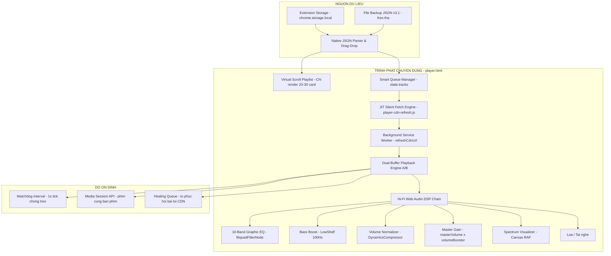

# 🎵 TikTok Hi-Fi Dedicated Player — Kiến Trúc & Lộ Trình Kỹ Thuật (v3)

> **Tài liệu kỹ thuật thực tế & kế hoạch cải tiến liên tục**
> **Dự án**: TikTok Random Liked Extension (Chrome MV3)
> **Trạng thái hiện tại**: DP-1 đến DP-3.5 (Phase 1 & Phase 2) đã hoàn thiện & vận hành ổn định. DP-3.5 (Phase 3), DP-4, DP-5 đang lên kế hoạch.

---

## 1. Tầm Nhìn & Kiến Trúc Thực Tế



### Tại sao mô hình Trình phát riêng là tối ưu?
1. **Triệt tiêu 100% nguy cơ WAF 403**: Không tự động mở tab, không chuyển trang TikTok. Fetch CDN ngầm từ Background Service Worker.
2. **RAM cực thấp và ổn định**: Virtual Scroll đảm bảo RAM chỉ tăng ~2MB/bài. Từ 60MB ban đầu → dao động quanh 100–130MB dù danh sách chứa 3.000+ video.
3. **Chất lượng âm thanh có thể tùy chỉnh**: Web Audio DSP với EQ 10 dải, Bass Boost, Volume Normalizer chạy real-time trên `AudioContext`.
4. **Không lo link CDN chết**: JIT Fetch làm mới CDN URL trước khi chuyển bài, không bao giờ phát link hết hạn.

---

## 2. Chuẩn Dữ Liệu & Đọc File JSON

Trình phát đọc trực tiếp file JSON backup v3.1 của extension, hỗ trợ kho 3.000+ video.

### 2.1. Cấu trúc JSON (v3.1)
```json
{
  "likedVideos": [
    {
      "url": "https://www.tiktok.com/@username/video/7646241652096404754",
      "thumb": "https://p16-common-sign.tiktokcdn-us.com/..."
    }
  ],
  "blacklistedVideos": [
    "https://www.tiktok.com/@spammer/video/1111111111111111111"
  ]
}
```

### 2.2. Nguyên tắc bất di bất dịch
* **Chỉ lưu Canonical URL** — tuyệt đối không lưu URL CDN `.mp4` vào storage lâu dài vì chữ ký Akamai hết hạn sau 12–24h.
* **JIT Fetch**: CDN URL chỉ được lấy ngay trước khi phát bài, cache trong RAM với TTL 15 phút (`CDN_CACHE_TTL_MS = 15 * 60 * 1000`).

---

## 3. Cấu Trúc File Thực Tế

```
Random-Video/
├── player.html                    # Giao diện 3-panel (Library / Stage / DSP) + Media Bar
├── style-player.css               # Glassmorphism, animations, virtual scroll
├── background.js                  # Service Worker: router message actions
├── js/
│   ├── background/
│   │   ├── bg-storage.js          # Healing Queue, likedVideos storage helpers
│   │   └── bg-playback.js         # refreshCdnUrl, healingQueue retry logic
│   └── player/
│       ├── player-app.js          # UI, Virtual Scroll, Queue, Event Delegation, Visualizer
│       ├── player-audio.js        # Web Audio DSP, EQ, Crossfade A/B, Watchdog
│       └── player-cdn-refresh.js  # Silent JIT Fetch, cdnCache TTL, prefetch
└── docs/
    └── Process-Dedicated-Player.md
```

---

## 4. Các Trụ Cột Kỹ Thuật Đã Hoàn Thiện

### Trụ Cột 1: JIT Silent Fetch Engine
* **`player-cdn-refresh.js`** giữ `cdnCache = new Map()` trong RAM.
* Gọi `chrome.runtime.sendMessage({ action: 'refreshCdnUrl' })` → Background fetch ngầm HTML trang TikTok → bóc tách `playAddr` từ JSON rehydration → trả về CDN URL tươi.
* Prefetch 3 bài tiếp theo sau khi bài hiện tại phát thành công.

### Trụ Cột 2: Hi-Fi DSP Chain & Dual-Buffer Crossfade
* **Chuỗi tín hiệu thực tế** ([`player-audio.js`](../js/player/player-audio.js)):
  ```
  sourceA/B → gainA/B → preMixGain → EQ[10] (Flat 0dB) → bassBoostNode (0dB)
            → compressorNode (-12dBFS) → makeupGainNode (+3.5dB) → compressorGain ─┐
                                                                                   ├─ postDSPCrossover → masterGain (100%) → analyser → output
            → bypassGain ──────────────────────────────────────────────────────────┘
  ```
* **Crossfade A/B**: Khi bài hiện tại còn `crossfadeDuration` giây, `gainA` fade-out đồng thời `gainB` fade-in. Chuẩn bị bài tiếp theo ở ngưỡng 85% thời lượng.
* **Watchdog 1s**: Phát hiện treo > 12s → emit `error` → auto-skip.

### Trụ Cột 3: Virtual Scroll Playlist
* Chỉ render 20–30 `.track-card` trong viewport + 5 phần tử đệm mỗi đầu.
* Dùng `paddingTop`/`paddingBottom` trên `#playlist-scroll-content` để giả lập chiều cao toàn danh sách cho scrollbar chính xác.
* **Event Delegation** một listener duy nhất trên `dom.playlist` thay vì gắn listener cho từng card.
* `refreshUI()` chỉ được gọi khi: tải JSON mới / tìm kiếm / xáo trộn / ban video.

### Trụ Cột 4: Healing Queue
* Khi bài bị lỗi CDN hoặc treo, trình phát gửi tín hiệu về Background để ghi vào `healingQueue` trong storage.
* Background retry có giới hạn (`HEALING_MAX_RETRIES`). Bài vượt quá giới hạn bị đánh dấu `status: "dead"`.

### Trụ Cột 5: Media Session API
* `navigator.mediaSession` nhận phím cứng Play/Pause/Next/Prev từ bàn phím và widget hệ điều hành.
* Đồng bộ blacklist ban video hai chiều về `chrome.storage.local`.

---

## 5. Lộ Trình Cải Tiến

### DP-1: Nền tảng UI + Silent JIT Fetcher — HOÀN THÀNH

Giao diện 3-panel Glassmorphism, kéo thả JSON, phát nhạc ngầm không mở tab TikTok.

### DP-2: Web Audio DSP + Dual-Buffer Crossfade — HOÀN THÀNH

EQ 10 dải, Bass Boost, Volume Normalizer, Crossfade A/B mượt mà.

### DP-3: Visualizer + Virtual Scroll — HOÀN THÀNH

Spectrum Canvas 60FPS tối ưu (tái dùng TypedArray, tạm dừng khi ẩn tab).
Virtual Scroll giảm RAM từ đỉnh 890MB xuống ổn định 100–130MB.

---

### DP-3.5: Chuẩn Hóa Loudness & Tối Ưu Âm Thanh (Audio Optimization) — ĐÃ TRIỂN KHAI (Đã Hoàn Thành)

Dựa trên nghiên cứu chuyên sâu tại [Audio-Quality-Final-Report.md](file:///d:/A.Myself/Random-Video/docs/Audio-Quality-Final-Report.md), chất lượng âm thanh của `player.html` được tối ưu hóa toàn diện theo lộ trình phân tầng kỹ thuật.

#### 1. Đã Hoàn Thành — Phase 1: Chuẩn Hóa Loudness & Tối Ưu DSP Mặc Định (P0)
* **Master Volume 100%**: Nâng `masterVolume = 1.0` (thay vì 0.72, triệt tiêu mức suy hao cố định `-2.85 dB`). Tự động lưu/khôi phục tùy chọn âm lượng qua `localStorage`.
* **Preset EQ Mặc Định Trung Tính (Flat)**: Đưa 10 dải Biquad về `0 dB`, tắt tăng cường hạ âm mặc định (`bassBoostGain = 0 dB`), giải phóng trọn vẹn headroom cho dải động.
* **Tái Cấu Hình DynamicsCompressor & Bổ Sung Makeup Gain (+3.5 dB)**:
  - `threshold`: `-12 dBFS`, `ratio`: `2:1`, `knee`: `15 dB`, `attack`: `10 ms`, `release`: `200 ms`.
  - Tích hợp node `makeupGainNode` ($+3.5\text{ dB}$, `gain.value = 1.496`) nằm ngay sau `compressorNode` $\rightarrow$ Triệt tiêu hoàn toàn hiện tượng bơm giật (pumping) và sụt giảm âm lượng.
* **Bàn Giao Kênh Dual-Buffer An Toàn**: Đảm bảo sau crossfade, kênh active luôn đạt `gain = 1.0` tuyệt đối.

#### 2. Đã Hoàn Thành — Phase 2: An Toàn Nguồn Stream & Chống Lỗi 403 (P0b)
* **Thứ Tự Phân Giải Luồng Media Ổn Định**: Ưu tiên luồng **TikWM Proxy Stream** (`play`) mang trọn vẹn dải âm thanh gốc AAC 128kbps, tốc độ phân giải nhanh ($200 - 300\text{ ms}$) và miễn nhiễm 100% với lỗi WAF 403.
* **DNR Request Headers Injection**: Tự động chèn `Referer: https://www.tiktok.com/` và `Origin: https://www.tiktok.com` cho mọi request media từ extension.
* **In-Memory Caching (TTL 20 phút)**: Lưu trữ tạm CDN URL và siêu dữ liệu `source` trong RAM.
* **Rate-Limit Hàng Đợi Hồi Sinh (Healing Queue)**: Chống spam gửi yêu cầu hồi sinh lặp lại trên cùng một URL (giãn cách 5 phút).
* **Loại Bỏ Lỗi CSP**: Xóa thuộc tính inline `onerror` trên ảnh bìa vinyl, tuân thủ nghiêm ngặt CSP Manifest V3.

#### 3. Kế Hoạch Tiếp Theo — Phase 3: Pure Direct Bypass & Volume Booster (P1)
1. **Chế độ Pure Direct (Bypass DSP 1:1)**: Bổ sung công tắc nối thẳng từ `preMixGain` tới `masterGainNode` để nghe âm thanh mộc gốc nguyên bản.
2. **Volume Booster trên UI**: Thêm nút chuyển nhanh $1.0\times$ / $1.25\times$ / $1.5\times$ có soft-clipping chống vỡ tiếng cho các video có âm lượng thu âm quá nhỏ.
3. **Cân chỉnh Preset Bass Boost**: Tăng cường dải mid-bass $125\text{ Hz} - 250\text{ Hz}$ tạo độ ấm và chắc tiếng thay vì dồn dải hạ âm $32\text{ Hz} - 64\text{ Hz}$.
4. **Huy hiệu hiển thị nguồn media**: Nhãn trạng thái trực quan trên UI (`[TIKWM PROXY]`, `[DIRECT]`, `[OFFLINE]`).

**Kết quả đạt được**: Âm lượng trên `player.html` đã đạt mức tương đương $1:1$ so với `tiktok.com` gốc ($\pm 1\text{ dB}$ RMS), âm thanh trong trẻo, vocal rõ ràng và không bị gián đoạn phát.

---

### DP-4: Lưu Trữ Nhạc Offline (IndexedDB Vault) — KẾ HOẠCH

Cho phép tải âm thanh xuống IndexedDB và phát lại khi mất mạng.
Hiện tại nút "Save" có trên UI nhưng chỉ đánh dấu `state.offlineSet`, chưa thực sự lưu dữ liệu nhị phân.

**Các nhiệm vụ**:
1. Viết `player-offline.js` — tải Blob binary từ CDN URL và ghi vào `indexedDB`.
2. Khi phát: ưu tiên đọc từ IndexedDB trước khi fetch CDN.
3. Hiển thị danh sách bài đã lưu ở tab **Offline** (tab đã có sẵn trên UI).

### DP-5: Bảng Điều Khiển Hợp Nhất & Popup Extension — KẾ HOẠCH

* Thêm nút mở/đóng nhanh Player từ `popup.html`.
* Lưu trạng thái EQ, Volume, preset vào `chrome.storage.local` để giữ nguyên giữa các phiên.

---

## 6. Bảng Kiểm Soát Rủi Ro (Thực Tế)

| Rủi ro | Mức độ | Cơ chế xử lý hiện tại |
|:---|:---:|:---|
| Link CDN hết hạn 12–24h | Cao | JIT Fetch lấy link mới ngay trước khi phát. `cdnCache` TTL 15 phút. |
| Bài bị treo / không phát | Cao | Watchdog 1s phát hiện sau 12s treo → auto-skip. Healing Queue retry. |
| Chặn Bot Detection (403) | Trung bình | Fetch ngầm từ Background SW có Cookie session hợp lệ. Delay ngẫu nhiên giữa các bài. |
| RAM tăng theo thời gian | Thấp | Virtual Scroll giới hạn DOM. GC tự dọn theo chu kỳ. Dao động 100–130MB là bình thường. |
| URL CDN dị biệt / JSON lỗi | Thấp | Regex parser bóc tách Username và ID. Thumbnail fallback. Bỏ qua bài lỗi format. |

---

*Tài liệu v3 — Cập nhật theo trạng thái vận hành thực tế của hệ thống.*

