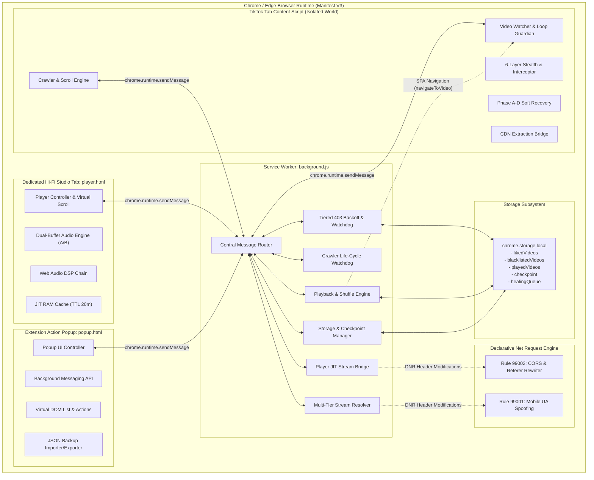
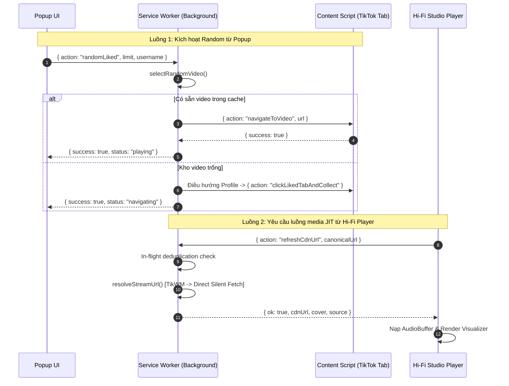
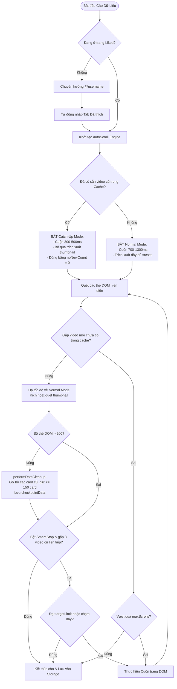
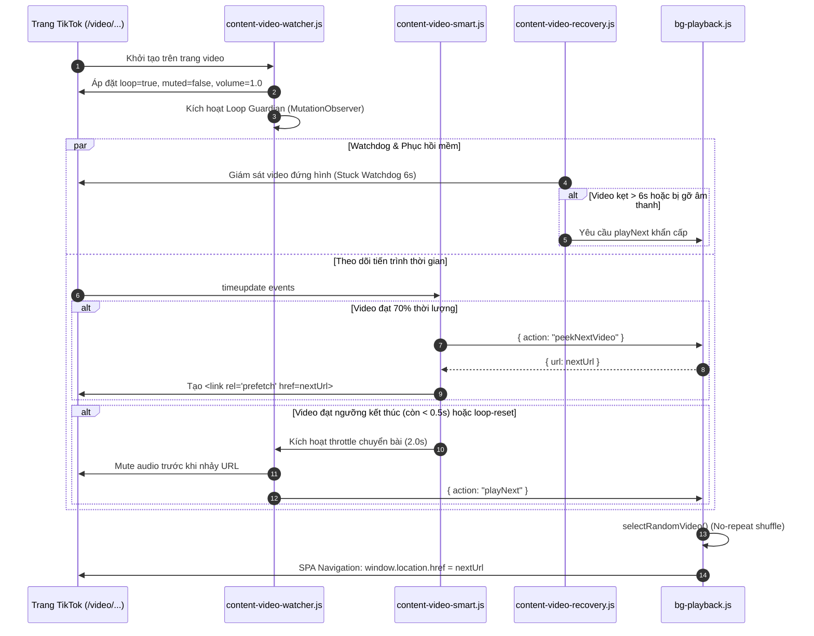
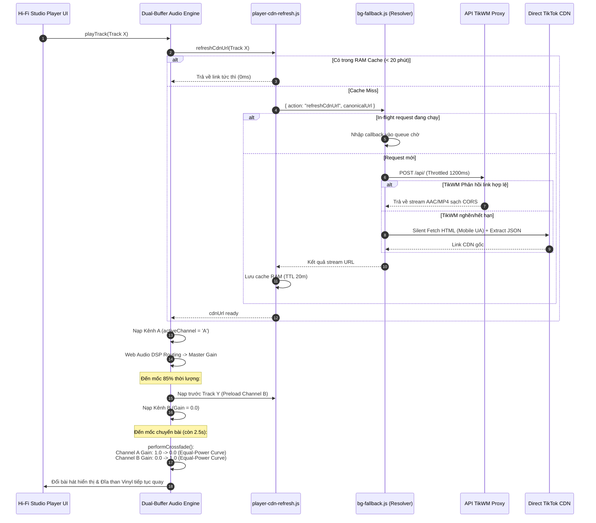
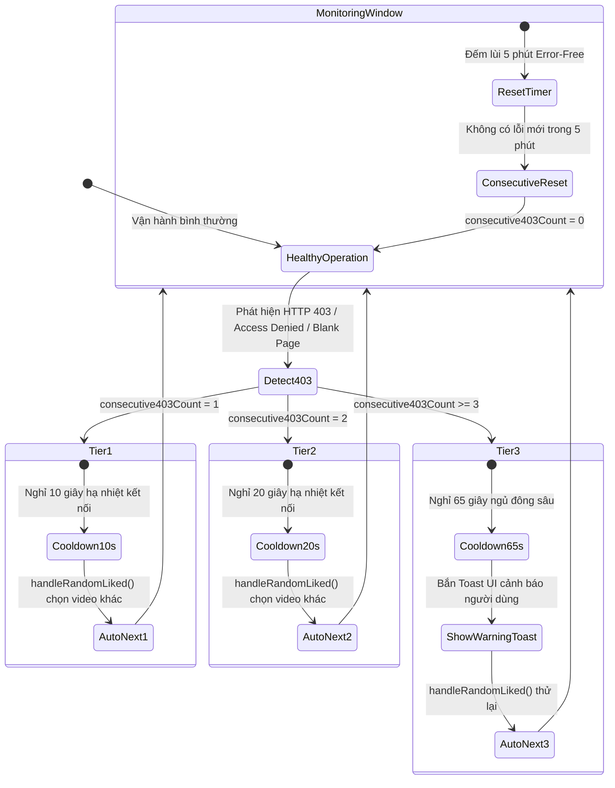

# 📐 TÀI LIỆU SYSTEM DESIGN — TIKTOK RANDOM LIKED (v3.5.4)

Tài liệu thiết kế kiến trúc kỹ thuật toàn diện cho tiện ích mở rộng trình duyệt **TikTok Random Liked** (Chrome / Edge / Brave Extension).

---

## MỤC LỤC

1. [TỔNG QUAN HỆ THỐNG (SYSTEM OVERVIEW)](#1-tổng-quan-hệ-thống-system-overview)
   - 1.1. Bối cảnh & Mục tiêu Kỹ thuật
   - 1.2. Thách thức Cốt lõi & Giải pháp Kiến trúc
   - 1.3. Nguyên tắc Thiết kế Bất biến (Core Invariants)
2. [KIẾN TRÚC TỔNG THỂ (HIGH-LEVEL ARCHITECTURE)](#2-kiến-trúc-tổng-thể-high-level-architecture)
   - 2.1. Sơ đồ Kiến trúc Phân lớp (Subsystems Diagram)
   - 2.2. Trục Giao tiếp Trung tâm (IPC & Message Passing Bus)
   - 2.3. Quy tắc Định tuyến Mạng Khai báo (Declarative Net Request - DNR)
3. [SƠ ĐỒ CLASS & MÔ ĐUN HỆ THỐNG (CLASS & MODULE DIAGRAMS)](#3-sơ-đồ-class--mô-đun-hệ-thống-class--module-diagrams)
   - 3.1. Sơ đồ Phân rã Mô đun Toàn cục
   - 3.2. Chi tiết Subsystem: Background Service Worker
   - 3.3. Chi tiết Subsystem: Content Script Engine
   - 3.4. Chi tiết Subsystem: Dedicated Hi-Fi Studio Player
   - 3.5. Chi tiết Subsystem: Popup UI Controller
4. [TYPES & DATA MODELS (MÔ HÌNH DỮ LIỆU & ĐỊNH KIỂU)](#4-types--data-models-mô-hình-dữ-liệu--định-kiểu)
   - 4.1. Thực thể Video & Metadata Models
   - 4.2. Storage Schema (`chrome.storage.local`)
   - 4.3. Message Protocol Contract (Action Types, Requests & Responses)
   - 4.4. State Management Models
   - 4.5. Audio & DSP Data Structures
   - 4.6. Backup Schema Contract (v3.1)
5. [THIẾT KẾ LUỒNG HOẠT ĐỘNG (SEQUENCE DIAGRAMS & WORKFLOWS)](#5-thiết-kế-luồng-hoạt-động-sequence-diagrams--workflows)
   - 5.1. Luồng Thu thập Dữ liệu Thích ứng (Adaptive Crawler Engine)
   - 5.2. Luồng Phát Trực tiếp trên Web TikTok (Web Controller & Loop Guardian)
   - 5.3. Luồng Giải mã Stream Đa cấp & Dual-Buffer Crossfade (Hi-Fi Studio)
   - 5.4. Luồng Phục hồi Lỗi Đa tầng (Tiered 403 Recovery & Auto-Healing)
6. [KIẾN TRÚC XỬ LÝ ÂM THANH (WEB AUDIO HI-FI DSP PIPELINE)](#6-kiến-trúc-xử-lý-âm-thanh-web-audio-hi-fi-dsp-pipeline)
   - 6.1. Audio Graph Routing Matrix
   - 6.2. Thuật toán Dynamics Compressor & Bù suy hao (Makeup Gain)
   - 6.3. Dual-Buffer Equal-Power Crossfading Mechanism
7. [BỘ PHÒNG VỆ 6 LỚP ANTI-DETECTION & BẢO VỆ WAF](#7-bộ-phòng-vệ-6-lớp-anti-detection--bảo-vệ-waf)
   - 7.1. Stealthing API & Bypass Visibility/Focus
   - 7.2. Chặn Telemetry & Chống Giám sát Hành vi
   - 7.3. Mô phỏng Hành vi Tự nhiên (Bézier Curves & Jitter)
8. [TỐI ƯU HÓA HIỆU NĂNG & QUẢN TRỊ TÀI NGUYÊN BỘ NHỚ](#8-tối-ưu-hóa-hiệu-năng--quản-trị-tài-nguyên-bộ-nhớ)
   - 8.1. DOM Truncation & Phân mảnh RAM trên Content Script
   - 8.2. Virtual Scrolling DOM Recycling trên Player Studio
   - 8.3. JIT In-flight Deduplication & RAM Caching (TTL 20 Phút)

---

## 1. TỔNG QUAN HỆ THỐNG (SYSTEM OVERVIEW)

### 1.1. Bối cảnh & Mục tiêu Kỹ thuật
**TikTok Random Liked** là giải pháp phần mềm dạng Chrome Extension (kiến trúc Manifest V3), giải quyết bài toán:
1. Cho phép người dùng thưởng thức kho video đã Like (yêu thích) trên TikTok một cách hoàn toàn ngẫu nhiên và không lặp lại (No-Repeat Shuffle Pool).
2. Cung cấp hai trải nghiệm phát biệt lập:
   - **TikTok Web Controller**: Điều hướng tab trình duyệt TikTok trực tiếp, tự chuyển video mượt mà qua Single Page Application (SPA), giữ giao diện tương tác gốc.
   - **TikTok Hi-Fi Studio**: Trình phát đa phương tiện chuyên biệt, cô lập khỏi DOM của TikTok, tiêu thụ ít hơn 95% CPU/RAM, sở hữu chuỗi xử lý âm thanh Web Audio DSP (10-Band EQ, Volume Normalizer, Pure Direct 1:1, Crossfade 2.5s).

### 1.2. Thách thức Cốt lõi & Giải pháp Kiến trúc

| Thách thức Kỹ thuật | Nguy cơ / Hệ quả | Giải pháp Thiết kế Hệ thống |
| :--- | :--- | :--- |
| **Akamai Bot Manager & WAF 403 Rate-Limit** | Chặn IP, hiện CAPTCHA, khóa cookie phiên nếu cào quá nhanh hoặc điều hướng liên tục. | Áp dụng cơ chế **Tiered 403 Backoff** (10s $\rightarrow$ 20s $\rightarrow$ 65s), tuyệt đối bảo toàn cookie Akamai (`_abck`, `bm_*`), giãn cách trễ ngẫu nhiên (Gaussian-like random delay). |
| **TikTok SPA Loop & Video Desync** | TikTok liên tục gỡ bỏ thuộc tính `loop`, tự cuộn sang feed video xu hướng ngẫu nhiên ngoài kho Like. | Thiết lập **Loop Guardian MutationObserver** thường trực; kiểm tra và áp lại `loop=true`; bắt sự kiện `timeupdate` ở mốc còn $<0.5\text{s}$ để chủ động chuyển bài qua `navigateToVideo`. |
| **Tràn bộ nhớ DOM (Memory Leaks)** | Cuộn cào 1.000 – 5.000 video trên trang TikTok làm phình to DOM tree ($>10.000$ elements), gây crash tab (`Out of Memory`). | Thuật toán **DOM Truncation** định kỳ (`performDomCleanup`), giữ số thẻ card hiển thị $\le 150$, lưu checkpoint tự động và khôi phục khi ngắt quãng. |
| **Stream CDN Expiration & CORS Blocking** | Link trực tiếp từ TikTok CDN hết hạn sau 2–24h (chữ ký `x-expires`), chặn CORS ngoài domain `tiktok.com`. | **Multi-Tier Fallback Resolver Engine** kết hợp **DNR Rule 99002** (tự chèn Header `Referer: https://www.tiktok.com/` và mở rộng `Access-Control-Allow-Origin: *`). |
| **Lệch pha âm lượng giữa các video** | Chất lượng thu âm trên TikTok chênh lệch từ $-24\text{ dBFS}$ đến $-6\text{ dBFS}$, gây giật mình hoặc quá nhỏ. | Chuỗi **DynamicsCompressorNode** kết hợp **Fixed Makeup Gain (+3.5 dB)** và **Volume Booster (1.0x – 3.0x)**. |

### 1.3. Nguyên tắc Thiết kế Bất biến (Core Invariants)
Dựa trên chỉ thị vận hành tại `.agents/rules/AGENTS.md`:
1. **Stability Over Performance**: Không tối ưu hóa tốc độ nếu có nguy cơ kích hoạt hệ thống WAF/Anti-Bot của Akamai.
2. **Never Delete Akamai Cookies**: Tuyệt đối không xóa cookie khớp `_abck`, `bm_`, `rate`, `limit`.
3. **SPA Navigation Only**: Điều hướng bằng `chrome.tabs.sendMessage` (`window.location.href`), chỉ dùng `chrome.tabs.update()` làm fallback khi content script chết.
4. **Passive on Non-Liked Pages**: Content script tuyệt đối ở trạng thái thụ động (Passive) khi người dùng duyệt FYP, Search, Profile thông thường.
5. **No Micro-Seek on Buffer**: Không can thiệp `currentTime += 0.01` khi xảy ra buffering để tránh làm rỗng bộ đệm media của trình duyệt.

---

## 2. KIẾN TRÚC TỔNG THỂ (HIGH-LEVEL ARCHITECTURE)

### 2.1. Sơ đồ Kiến trúc Phân lớp (Subsystems Diagram)



### 2.2. Trục Giao tiếp Trung tâm (IPC & Message Passing Bus)
Hệ thống sử dụng cơ chế IPC bất đối xứng thông qua `chrome.runtime.sendMessage` và `chrome.tabs.sendMessage`:



### 2.3. Quy tắc Định tuyến Mạng Khai báo (Declarative Net Request - DNR)
Extension duy trì 2 bộ quy tắc động (Dynamic Rules) được cấp phép qua quyền `"declarativeNetRequest"`:

#### Rule 99001: Mobile User-Agent Spoofing (`bg-fallback.js`)
- **Mục tiêu**: Giả lập định dạng Safari iOS khi Background gửi `fetch()` trích xuất nội dung HTML trang video TikTok, ép TikTok render cấu trúc DOM tối giản nhẹ hơn 70%.
- **Action**: Thay thế header `User-Agent` thành `MOBILE_UA` (`Mozilla/5.0 (iPhone; CPU iPhone OS 17_0 like Mac OS X)...`).
- **Condition**: Chỉ áp dụng cho initiator là Extension ID (`chrome.runtime.id`), khớp miền `||www.tiktok.com`.

#### Rule 99002: Player CORS & Referer Isolation (`bg-player.js`)
- **Mục tiêu**: Vượt qua rào cản Hotlink Protection của TikTok CDN trên thẻ `<audio>` và trích xuất raw media data vào Web Audio API `AudioContext`.
- **Action**:
  - Request Headers: Ép `Referer: https://www.tiktok.com/`, `Origin: https://www.tiktok.com`.
  - Response Headers: Chèn `Access-Control-Allow-Origin: *`, `Access-Control-Expose-Headers: Content-Length, Content-Range, Accept-Ranges`.
- **Condition**: Bắt các yêu cầu loại `media`, `xmlhttprequest`, `other` phát xuất từ tab Player của Extension.

---

## 3. SƠ ĐỒ CLASS & MÔ ĐUN HỆ THỐNG (CLASS & MODULE DIAGRAMS)

Hệ thống được phát triển theo mô hình Module Vanilla JS (tương thích Manifest V3 Service Worker và Content Scripts). Dưới đây là kiến trúc lớp logic trừu tượng hóa mô hình hóa các module và mối quan hệ giữa chúng.

### 3.1. Sơ đồ Quan hệ Mô đun Toàn cục

```mermaid
classDiagram
    %% Background Classes
    class ServiceWorkerRouter {
        +addListener(request, sender, sendResponse)
        +initWatchdogAndTabListeners()
    }
    class BgStorage {
        +progressState: ProgressState
        +handleSaveCheckpoint(checkpoint)
        +handleGetCheckpoint()
        +handleVideosCollected(request)
        +handleEnqueueForHealing(request)
        +handleHealVideo(request)
        +handleExportData()
        +handleImportData(payload)
    }
    class BgPlayback {
        +selectRandomVideo(excludeUrl) VideoResult
        +peekNextVideo(excludeUrl) PeekResult
        +handlePlayNext(tabId)
        +handleSkipAndPlayNext()
        +handleBanAndPlayNext()
    }
    class BgFallback {
        +_throttledFetchTikwm(canonicalUrl, signal)
        +_doSilentFetch(canonicalUrl, videoId, signal)
        +_extractCdnFromHtml(html, videoId)
        +resolveStreamUrl(canonicalUrl, videoId, signal)
    }
    class BgRecovery {
        -consecutive403Count: int
        -last403TriggerTime: long
        +triggerTiered403Recovery(reason, tabId)
        +getTieredCooldown(count) int
        +is403OrErrorTab(tab) bool
    }
    class BgCollections {
        -activeCollectionJob: Job
        +startCollectionJob(tabId, limit, username, append, autoPlay, smartStop)
        +runJobCycle()
    }

    %% Content Script Classes
    class ContentCore {
        +isCollecting: bool
        +isCatchingUp: bool
        +autoScroll(limit, interval, existing, smartStop, append)
        +collectVideoUrls(skipThumb)
        +sendVideosToBackground(append)
    }
    class ContentCheckpoint {
        +performDomCleanup()
        +saveCheckpointData(silent)
        +resumeFromCheckpoint()
    }
    class ContentVideoWatcher {
        +currentVideoElement: HTMLVideoElement
        +loopObserver: MutationObserver
        +watchForVideoElement()
        +onVideoTimeUpdate()
        +onVideoEnded()
        +_checkAndHealVideo(video)
    }
    class ContentVideoSmart {
        +smartPreloadNextVideo()
        +checkEarlySkipCondition()
    }
    class ContentVideoRecovery {
        +startStuckMonitor()
        +handleSoftPleaseWaitRecovery()
        +isMutedOrCopyrighted() bool
        +isShopVideo() bool
    }
    class ContentStealth {
        +initVisibilityBypass()
        +initFocusBypass()
        +initNavigatorSpoof()
    }
    class ContentInterceptor {
        +initTelemetryBlock()
        +showToast(message, type)
    }

    %% Player Classes
    class PlayerApp {
        +state: PlayerState
        +init()
        +bindEvents()
        +renderVirtualList()
        +startSpectrumVisualizer()
    }
    class PlayerAudio {
        -audioCtx: AudioContext
        -playerA: HTMLAudioElement
        -playerB: HTMLAudioElement
        -activeChannel: string
        +playTrack(track, url)
        +performCrossfade(newTrack, newUrl)
        +setLoop(enabled)
        +seekTo(pct)
    }
    class PlayerAudioDSP {
        -eqFilters: BiquadFilterNode[]
        -compressorNode: DynamicsCompressorNode
        -makeupGainNode: GainNode
        -masterGainNode: GainNode
        -analyserNode: AnalyserNode
        +buildDspChain(audioCtx, preMixGain)
        +setSoundMode(mode)
        +setVolume(pct)
        +setVolumeBooster(multiplier)
        +setEQPreset(name)
        +setBassBoost(gainDb)
    }
    class PlayerCDN {
        -cdnCache: Map
        +refreshCdnUrl(canonicalUrl)
        +prefetchTracks(urls)
        +hasCached(canonicalUrl) bool
    }

    %% Relationships
    ServiceWorkerRouter --> BgStorage
    ServiceWorkerRouter --> BgPlayback
    ServiceWorkerRouter --> BgFallback
    ServiceWorkerRouter --> BgRecovery
    ServiceWorkerRouter --> BgCollections

    BgPlayback --> BgStorage : Reads/Updates storage
    BgRecovery --> BgPlayback : Triggers auto-next
    BgCollections --> ContentCore : Dispatches commands

    ContentCore --> ContentCheckpoint : Truncates DOM & Checkpoints
    ContentCore --> ContentStealth : Uses stealth layer
    ContentVideoWatcher --> ContentVideoSmart : Triggers Preload
    ContentVideoWatcher --> ContentVideoRecovery : Monitors stuck/muted
    ContentVideoWatcher --> ContentInterceptor : Displays notifications

    PlayerApp --> PlayerAudio : Controls playback
    PlayerApp --> PlayerAudioDSP : Configures effects
    PlayerApp --> PlayerCDN : Resolves streams
    PlayerAudio --> PlayerAudioDSP : Connects Web Audio Nodes
```



---

## 4. TYPES & DATA MODELS (MÔ HÌNH DỮ LIỆU & ĐỊNH KIỂU)

Tất cả các mô hình dữ liệu trong hệ thống được quy chuẩn hóa thành cấu trúc TypeScript interface:

### 4.1. Thực thể Video & Metadata Models

```typescript
/**
 * Đại diện cơ bản cho một video được thu thập từ DOM trang Liked
 */
export interface VideoItem {
  /** Đường dẫn đầy đủ của video trên TikTok, có thể chứa query params */
  url: string;
  /** Link ảnh thumbnail trích xuất từ srcset/src của video card */
  thumb: string;
}

/**
 * Định dạng chuẩn hóa (Canonical) loại bỏ tham số query tracking
 */
export interface CanonicalVideoItem {
  /** URL chuẩn dạng: https://www.tiktok.com/@username/video/1234567890 */
  canonicalUrl: string;
  thumb: string;
  videoId: string;
  username: string;
}

/**
 * Mô hình bài hát trong Playlist của TikTok Hi-Fi Studio
 */
export interface TrackModel {
  /** Video ID dạng chuỗi số */
  id: string;
  /** URL canonical của video */
  canonicalUrl: string;
  /** Ảnh thumbnail chất lượng cao */
  thumb: string;
  /** Tên tác giả dạng @creator */
  username: string;
  /** Tiêu đề hiển thị trên UI player */
  title: string;
  /** Lớp CSS màu nền ngẫu nhiên tạo album art placeholder */
  bgClass: 'bg-a' | 'bg-b' | 'bg-c' | 'bg-d' | 'bg-e';
  /** Trạng thái lưu trữ offline trong cache trình duyệt */
  isOffline?: boolean;
}
```

### 4.2. Storage Schema (`chrome.storage.local`)

```typescript
export interface TikTokExtensionStorage {
  /** Danh sách video đã cào thành công */
  likedVideos: VideoItem[];
  /** Danh sách URL canonical của các video bị cấm vĩnh viễn */
  blacklistedVideos: string[];
  /** Danh sách URL canonical của các video đã phát trong chu kỳ hiện tại (tránh lặp) */
  playedVideos: string[];
  /** Dấu thời gian (timestamp ms) của phiên thu thập gần nhất */
  collectedAt: number | null;
  /** Tên tài khoản TikTok của người dùng */
  tiktokUsername: string;
  /** Số lượng video mục tiêu được cài đặt trên popup */
  targetLimit: number;
  /** Trạng thái Bật/Tắt tự động nhảy video khi kết thúc */
  autoNextEnabled: boolean;
  /** Dữ liệu sao lưu tiến trình cào dở */
  checkpoint: CheckpointData | null;
  /** Hàng đợi các video bị lỗi stream chờ phục hồi */
  healingQueue: HealingEntry[];
  /** Trạng thái công tắc cho phép tự động heal video */
  healingEnabled: boolean;
  /** Cờ đánh dấu tiến trình Batch Healing đang hoạt động */
  healingModeActive: boolean;
  /** Bộ đếm số video thông thường đã phát giữa các lần ưu tiên heal */
  normalVideosPlayedCount: number;
}
```

### 4.3. Message Protocol Contract (IPC Actions)

```typescript
/**
 * Định nghĩa hợp đồng thông điệp trao đổi qua chrome.runtime.sendMessage
 */
export type RuntimeAction =
  | 'randomLiked'
  | 'handle403Detected'
  | 'collectMore'
  | 'skipAndPlayNext'
  | 'banAndPlayNext'
  | 'collectAndPlay'
  | 'playNext'
  | 'peekNextVideo'
  | 'saveCheckpoint'
  | 'getCheckpoint'
  | 'clearCheckpoint'
  | 'collectionProgress'
  | 'getProgress'
  | 'videosCollected'
  | 'getVideoCount'
  | 'getVideoList'
  | 'deleteVideo'
  | 'banVideo'
  | 'exportData'
  | 'importData'
  | 'clearCache'
  | 'getAutoNextState'
  | 'setAutoNext'
  | 'refreshCdnUrl'
  | 'GET_STREAM_URL'
  | 'openPlayerTab'
  | 'enqueueForHealing'
  | 'healVideo'
  | 'markHealingDead'
  | 'getHealingQueue'
  | 'clearHealingQueue'
  | 'startBatchHealing'
  | 'stopBatchHealing'
  // Actions Content Script lắng nghe từ Background
  | 'startCollecting'
  | 'clickLikedTabAndCollect'
  | 'continueCollecting'
  | 'getStatus'
  | 'navigateToVideo'
  | 'ping'
  | 'showWarningToast';

export interface BaseMessageRequest {
  action: RuntimeAction;
}

export interface RefreshCdnUrlRequest extends BaseMessageRequest {
  action: 'refreshCdnUrl' | 'GET_STREAM_URL';
  canonicalUrl?: string;
  tiktokUrl?: string;
}

export interface RefreshCdnUrlResponse {
  ok: boolean;
  cdnUrl?: string;
  cover?: string;
  title?: string;
  source?: 'tikwm' | 'tiktok-direct' | 'cobalt' | 'tiksave' | 'unknown';
  fromCache?: boolean;
  isNetworkError?: boolean;
  error?: string;
}

export interface NavigateToVideoMessage extends BaseMessageRequest {
  action: 'navigateToVideo';
  url: string;
}
```

### 4.4. State Management Models

```typescript
/** Trạng thái tiến trình cào dữ liệu được đồng bộ về Background */
export interface ProgressState {
  isCollecting: boolean;
  scrollCount: number;
  maxScrolls: number;
  count: number;
  newCount?: number;
  limit?: number;
  status: 'idle' | 'collecting' | 'catchup' | 'slow_network' | 'complete';
  missingThumbs?: number;
  newAddedCount?: number;
}

/** Cấu trúc Checkpoint sao lưu khi cuộn cào trang dài */
export interface CheckpointData {
  timestamp: number;
  collectedVideos: VideoItem[];
  scrollOffset: number;
  targetLimit: number;
  username: string;
}

/** Trạng thái 1 phần tử trong Healing Queue */
export interface HealingEntry {
  url: string;
  reason: string;
  addedAt: number;
  retryCount: number;
  lastRetryAt: number | null;
  status: 'pending' | 'healed' | 'dead';
  healedAt?: number;
  newCdnUrl?: string;
}
```

### 4.5. Audio & DSP Data Structures

```typescript
export interface AudioMetrics {
  currentTrackId: string | null;
  activeChannel: 'A' | 'B';
  isCrossfading: boolean;
  soundMode: 'hifi' | 'pure_direct';
  normalizerActive: boolean;
  bassBoostGainDb: number;
  boosterMultiplier: number;
  masterVolumePct: number;
  spectrumFftData?: Uint8Array;
}
```

### 4.6. Backup Schema Contract (v3.1)

```typescript
export interface ExtensionBackupV31 {
  version: '3.1';
  exportAt: number;
  collectedAt: number | null;
  tiktokUsername: string;
  targetLimit: number;
  videoCount: number;
  blacklistedCount: number;
  likedVideos: VideoItem[];
  blacklistedVideos: string[];
}
```

---

## 5. THIẾT KẾ LUỒNG HOẠT ĐỘNG (SEQUENCE DIAGRAMS & WORKFLOWS)

### 5.1. Luồng Thu thập Dữ liệu Thích ứng (Adaptive Crawler Engine)
Cơ chế tự động thích ứng giữa hai giai đoạn: **Catch-Up Phase** (lướt nhanh qua vùng video cũ) và **Normal Phase** (quét cẩn trọng trích xuất thumbnail).



### 5.2. Luồng Phát Trực tiếp trên Web TikTok (Web Controller & Loop Guardian)
Đảm bảo tự động hóa việc xem video mà không làm đứt mạch trải nghiệm người dùng và không bị thuật toán đề xuất của TikTok dẫn dắt sang video ngoài danh sách thích.



### 5.3. Luồng Giải mã Stream Đa cấp & Dual-Buffer Crossfade (Hi-Fi Studio)



### 5.4. Luồng Phục hồi Lỗi Đa tầng (Tiered 403 Recovery & Auto-Healing)



---

## 6. KIẾN TRÚC XỬ LÝ ÂM THANH (WEB AUDIO HI-FI DSP PIPELINE)

### 6.1. Audio Graph Routing Matrix
Toàn bộ quá trình giải mã và tái tạo âm thanh của **TikTok Hi-Fi Studio** được định tuyến qua hệ thống nút xử lý của Web Audio API:

```text
[ Dual-Buffer Audio Elements ]
  ├── HTML5 Audio (Player A) ──> MediaElementAudioSourceNode (sourceA) ──> GainNode (gainA: 1.0 -> 0.0) ──┐
  └── HTML5 Audio (Player B) ──> MediaElementAudioSourceNode (sourceB) ──> GainNode (gainB: 0.0 -> 1.0) ──┤
                                                                                                          ▼
                                                                                            [ GainNode (preMixGain: 1.0) ]
                                                                                                          │
                                 ┌────────────────────────────────────────────────────────────────────────┴──────────────────────────────────────┐
                                 │ Chế độ: Hi-Fi DSP (dspBranchGain: 1.0)                                                                        │ Chế độ: Pure Direct (directBranchGain: 1.0)
                                 ▼                                                                                                               ▼
             [ 10-Band BiquadFilter Equalizer ]                                                                                                  │
               ├── 32 Hz   (lowshelf, Q=1.4)                                                                                                     │
               ├── 64 Hz   (peaking,  Q=1.4)                                                                                                     │
               ├── 125 Hz  (peaking,  Q=1.4)                                                                                                     │
               ├── 250 Hz  (peaking,  Q=1.4)                                                                                                     │
               ├── 500 Hz  (peaking,  Q=1.4)                                                                                                     │
               ├── 1.0 kHz (peaking,  Q=1.4)                                                                                                     │
               ├── 2.0 kHz (peaking,  Q=1.4)                                                                                                     │
               ├── 4.0 kHz (peaking,  Q=1.4)                                                                                                     │
               ├── 8.0 kHz (peaking,  Q=1.4)                                                                                                     │
               └── 16.0 kHz (highshelf, Q=1.4)                                                                                                   │
                                 │                                                                                                               │
                                 ▼                                                                                                               │
                 [ Deep Bass Booster Node ]                                                                                                      │
                 (lowshelf, 100 Hz, 0 -> +12 dB)                                                                                                 │
                                 │                                                                                                               │
                                 ▼                                                                                                               │
              [ DynamicsCompressor Volume Normalizer ]                                                                                           │
              (threshold: -12 dBFS, ratio: 2:1, knee: 15, attack: 10ms, release: 200ms)                                                         │
                                 │                                                                                                               │
                                 ▼                                                                                                               │
                       [ Makeup Gain Node ]                                                                                                      │
                       (+3.5 dB, gain = 1.496)                                                                                                   │
                                 │                                                                                                               │
                                 └────────────────────────────────────────┬──────────────────────────────────────────────────────────────────────┘
                                                                          │
                                                                          ▼
                                                         [ Master Gain & Booster Node ]
                                                         (Volume: 0.0 - 1.0 * Booster: 1.0x - 3.0x)
                                                                          │
                                                                          ▼
                                                         [ Real-Time AnalyserNode (FFT) ]
                                                         (fftSize: 128, 32 Frequency Bars, smoothing: 0.8)
                                                                          │
                                                                          ▼
                                                          [ AudioDestinationNode: Loa/Tai nghe ]
```

### 6.2. Thuật toán Dynamics Compressor & Bù suy hao (Makeup Gain)
Trong môi trường video ngắn, sự chênh lệch lớn về mức âm lượng yêu cầu bộ nén động học tự động:
1. **Compressor Parameters**:
   - **Threshold** = $-12\text{ dBFS}$: Chỉ nén các đỉnh âm thanh vượt quá $-12\text{ dBFS}$.
   - **Ratio** = $2:1$: Tỷ lệ nén nhẹ, bảo toàn độ dynamic tự nhiên mà không gây hiện tượng "bóp nghẹt" (pumping).
   - **Attack** = $10\text{ ms}$ & **Release** = $200\text{ ms}$: Thời gian đáp ứng nhanh bắt trọn transient đỉnh và nhả mượt mà.
2. **Makeup Gain**:
   - Hiện tượng nén động học làm suy giảm mức đỉnh trung bình khoảng $-3.5\text{ dB}$.
   - Bổ sung `makeupGainNode` với giá trị cố định $1.496$ (tương đương $+3.5\text{ dB}$) đưa năng lượng trung bình trở lại mức danh định tối ưu trước khi tới tầng Master.

### 6.3. Dual-Buffer Equal-Power Crossfading Mechanism
Để tránh hiện tượng sụt giảm âm lượng ở giao điểm chuyển bài (center dip), hệ thống sử dụng thuật toán đường cong **Equal-Power Crossfade**:

$$\text{Gain}_{\text{Out}}(t) = \cos\left(\frac{\pi}{2} \cdot \frac{t}{T}\right), \quad \text{Gain}_{\text{In}}(t) = \sin\left(\frac{\pi}{2} \cdot \frac{t}{T}\right)$$

Trong đó:
- $T$: Thời lượng crossfade (mặc định $2.5\text{ s}$, có thể cấu hình từ $0.1\text{ s} - 5.0\text{ s}$).
- Đảm bảo tổng công suất âm thanh luôn không đổi: $\text{Gain}_{\text{Out}}^2(t) + \text{Gain}_{\text{In}}^2(t) = 1$.

---

## 7. BỘ PHÒNG VỆ 6 LỚP ANTI-DETECTION & BẢO VỆ WAF

Trang web TikTok tích hợp nhiều hệ thống bảo mật phía client (Slardar, Mon, MSSDK, Webdriver heuristics). Extension triển khai bộ phòng vệ đa lớp tích hợp sâu:

| Lớp (Layer) | Tên kỹ thuật | Mô đun đảm nhiệm | Cơ chế can thiệp chi tiết |
| :--- | :--- | :--- | :--- |
| **Lớp 1** | **Visibility Bypass** | `content-stealth.js` | Ghi đè `document.hidden` luôn trả về `false`, `document.visibilityState` luôn là `'visible'`. Đánh chặn và gọi `e.stopImmediatePropagation()` trên toàn bộ sự kiện `visibilitychange` để ngăn TikTok pause video khi chuyển tab. |
| **Lớp 2** | **Focus & Blur Spoof** | `content-stealth.js` | Ghi đè `document.hasFocus()` luôn trả về `true`. Đánh chặn sự kiện `blur` trên `window` và `document`. |
| **Lớp 3** | **Navigator Spoofing** | `content-stealth.js` | Che giấu dấu vết tự động hóa bằng cách gỡ bỏ hoặc spoof `navigator.webdriver = false`, giả lập danh sách plugins và audio hardware concurrency. |
| **Lớp 4** | **Human Behavior Simulation** | `content-behavior.js` | Giả lập quỹ đạo di chuyển chuột theo đường cong Cubic Bézier mượt mà kèm rung tay tự nhiên (spatial jitter $\pm 2\text{px}$), vi cuộn ngược (micro reverse-scroll 15–30px), và khoảng nghỉ sinh học định kỳ (Milestone Idle 8–15s). |
| **Lớp 5** | **Telemetry Interceptor** | `content-interceptor.js` | Monkey-patch `XMLHttpRequest.prototype.open`, `window.fetch`, và `navigator.sendBeacon`. Vô hiệu hóa và giả lập phản hồi HTTP 200 `{}` đối với toàn bộ các endpoint giám sát bot (`slardar`, `mon.tiktokv.com`, `mssdk`, `/api/v1/track`). |
| **Lớp 6** | **Tiered Error Recovery** | `content-video-recovery.js` & `bg-recovery.js` | Tự động hóa phục hồi màn hình *"Please Wait / Vui lòng chờ"* (Phase A–D), Watchdog phát hiện video đứng 6s, phát hiện video tắt tiếng bản quyền, và hạ nhiệt kết nối bậc thang khi gặp lỗi 403 WAF. |

---

## 8. TỐI ƯU HÓA HIỆU NĂNG & QUẢN TRỊ TÀI NGUYÊN BỘ NHỚ

### 8.1. DOM Truncation & Phân mảnh RAM trên Content Script
- **Hiện tượng**: Khi cuộn trang để lấy 1.000+ video, TikTok render hàng ngàn phần tử `<div data-e2e="user-liked-item">` kèm ảnh thumbnail và DOM node phức tạp, khiến dung lượng RAM của tab tăng vọt từ $200\text{MB}$ lên trên $1.8\text{GB}$, dẫn đến trình duyệt tự động tắt tab (crash `Out of Memory`).
- **Chiến lược Giải quyết (`performDomCleanup`)**:
  - Khi số lượng phần tử card trong DOM vượt quá $200$, hệ thống kích hoạt dọn dẹp:
  - Giữ lại tối đa $150$ card gần nhất trong viewport.
  - Các card cũ phía trên được gỡ bỏ khỏi DOM (`node.remove()`), nhưng thông tin URL và thumbnail đã được đồng bộ an toàn trong `collectedMap`.
  - Tự động lưu `checkpoint` vào storage cục bộ để đảm bảo an toàn dữ liệu.

### 8.2. Virtual Scrolling DOM Recycling trên Player Studio
- **Hiện tượng**: Danh sách phát của Player Studio có thể chứa tới 3.000 – 10.000 video. Nếu tạo từng đấy thẻ HTML card sẽ làm đứng giao diện UI.
- **Chiến lược Giải quyết (`player-app.js`)**:
  - Áp dụng thuật toán **Virtual Scrolling với Dynamic Recycling**:
  - Chiều cao mỗi dòng cố định ($64\text{px}$).
  - Tổng chiều cao container được tính bằng `totalTracks * 64px`.
  - Chỉ render duy nhất các hàng hiển thị trong Viewport cộng thêm một lượng đệm nhỏ (Buffer $\approx 5$ phần tử trên và dưới).
  - Khi người dùng cuộn, các thẻ DOM được tái sử dụng (re-bind data và cập nhật `translateY`), giúp duy trì bộ nhớ RAM của tab Player ổn định ở mức $100\text{MB} - 130\text{MB}$ bất kể danh sách dài bao nhiêu.

### 8.3. JIT In-flight Deduplication & RAM Caching (TTL 20 Phút)
- **In-flight Deduplication (`bg-player.js`)**:
  - Khi cả Player (kênh phát hiện tại) và bộ Preloader (kênh nạp trước) cùng lúc yêu cầu phân giải stream cho cùng một URL canonical, hệ thống dùng bảng ánh xạ `_inflightRefreshes = new Map<string, Callback[]>()`.
  - Chỉ duy nhất 1 tác vụ mạng được gửi đi; khi có kết quả, toàn bộ callback đang chờ đều nhận được dữ liệu đồng thời.
- **Client RAM Caching (`player-cdn-refresh.js`)**:
  - Link CDN giải mã được lưu trên RAM với TTL $20\text{ phút}$.
  - Giúp việc tua lại bài, chuyển bài lặp lại (loop) diễn ra tức thì trong $0\text{ms}$ mà không phát sinh thêm bất kỳ request mạng nào ra ngoài.
