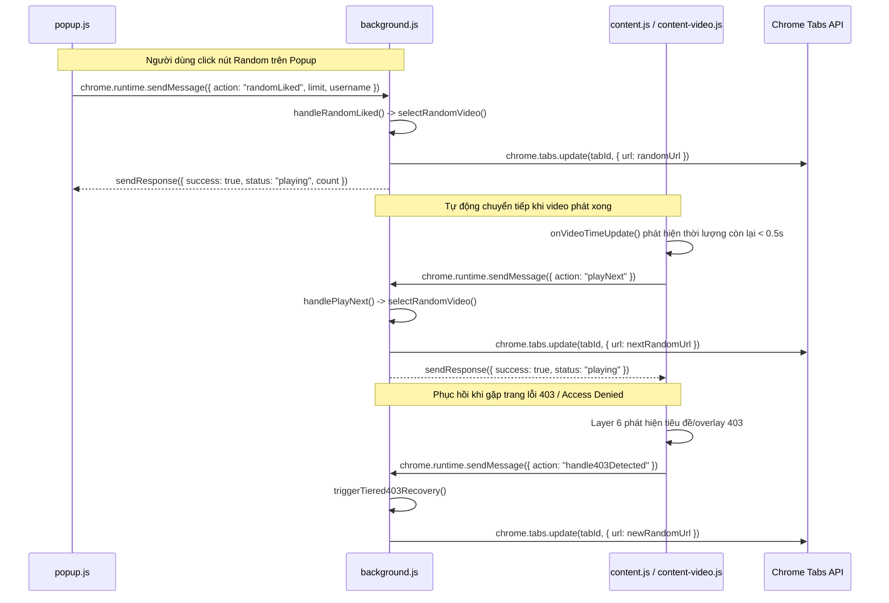
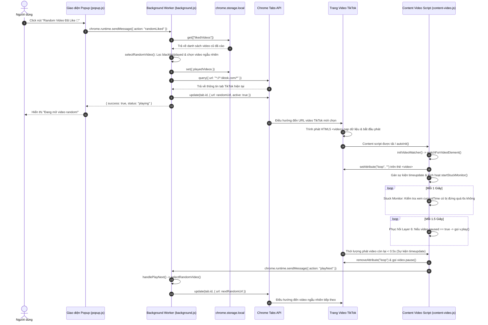

# Kiến trúc & Luồng Thực thi Phát Video TikTok Ngẫu nhiên

Tài liệu này cung cấp bảng phân tích kỹ thuật chi tiết theo từng hàm về cách extension **TikTok Random Liked** lựa chọn video ngẫu nhiên, điều hướng trình duyệt, giám sát trạng thái video và kiểm soát playback.

---

## 1. Sơ đồ Luồng Thực thi Tổng quát

```text
[Popup UI] Người dùng click nút "Random Video Đã Like 🎲"
  │
  ▼ (chrome.runtime.sendMessage: { action: "randomLiked" })
[Background Service Worker] background.js
  │
  ├── chrome.storage.local.get(["likedVideos", "playedVideos", "blacklistedVideos"])
  ├── selectRandomVideo(): Lọc video trong blacklist & đã phát, chọn video ngẫu nhiên
  └── getOrCreateTikTokTab(randomUrl): Tìm/tạo tab TikTok và cập nhật URL video
        │
        ▼ (chrome.tabs.update: { url: randomUrl })
[Trình duyệt Chrome] Điều hướng tab đến https://www.tiktok.com/@user/video/123456...
  │
  ▼
[Trình phát Web TikTok] Trang được tải & thẻ HTML5 <video> gốc bắt đầu phát
  │
  ▼
[Content Scripts] content.js / js/content-video.js
  ├── Layer 1-5: Bypass visibility, focus, và các endpoint telemetry WAF
  ├── Layer 6: initPlaybackRecovery() -> định kỳ gọi v.play() kiểm tra
  └── initVideoWatcher() -> watchForVideoElement()
        ├── Áp thuộc tính loop (ngăn TikTok tự cuộn feed gợi ý)
        ├── Đăng ký sự kiện timeupdate (phát hiện video sắp hết khi còn < 0.5s)
        ├── startStuckMonitor(): Giám sát đứng hình 6 giây (phục hồi mềm ở 5s)
        └── checkVideoAudioAndShop(): Tự động bỏ qua video bị tắt tiếng hoặc shop
              │
              ▼ (Video phát hết hoặc kích hoạt tự chuyển tiếp)
[Content Script] requestNextVideo()
  │
  ▼ (chrome.runtime.sendMessage: { action: "playNext" })
[Background Service Worker] handlePlayNext() -> selectRandomVideo() -> chrome.tabs.update()
```

---

## 2. Luồng Gọi Hàm Chi tiết (Function Call Flow)

Trình tự thực thi của tất cả các hàm tham gia vào quá trình phát ngẫu nhiên:

| Thứ tự | Đường dẫn File | Tên Hàm | Mục đích | Kích hoạt bởi | Gọi đến |
| :--- | :--- | :--- | :--- | :--- | :--- |
| 1 | [popup.js](file:///d:/A.Myself/Random-Video/popup.js) | Lắng nghe sự kiện `randomBtn.click` | Xử lý click giao diện, kiểm tra dữ liệu đầu vào, gọi background | Click chuột của người dùng vào nút `#randomBtn` | `sendMsg({ action: "randomLiked" })`, `startProgressPoller()`, `setLoading()` |
| 2 | [popup.js](file:///d:/A.Myself/Random-Video/popup.js) | `sendMsg(data)` | Bọc hàm `chrome.runtime.sendMessage` trong một Promise | Lời gọi từ `randomBtn.click`, `skipBtn.click`, `banBtn.click` | `chrome.runtime.sendMessage()` |
| 3 | [background.js](file:///d:/A.Myself/Random-Video/background.js) | Trình lắng nghe `chrome.runtime.onMessage` | Bộ định tuyến tin nhắn chính trong Service Worker | Sự kiện Message từ Chrome Runtime | `handleRandomLiked()`, `sendResponse()` |
| 4 | [background.js](file:///d:/A.Myself/Random-Video/background.js) | `handleRandomLiked(limit, username)` | Quản lý tra cứu bộ nhớ đệm và kích hoạt điều hướng video | Nhận tin từ `chrome.runtime.onMessage`, hoặc phục hồi lỗi 403 của watchdog | `chrome.storage.local.get()`, `selectRandomVideo()`, `getUrl()`, `getOrCreateTikTokTab()` |
| 5 | [background.js](file:///d:/A.Myself/Random-Video/background.js) | `selectRandomVideo(excludeUrl)` | Lựa chọn ngẫu nhiên một video chưa phát và không bị cấm | Lời gọi từ `handleRandomLiked()`, `handlePlayNext()`, `handleSkipAndPlayNext()` | `chrome.storage.local.get()`, `chrome.storage.local.set()`, `getUrl()` |
| 6 | [background.js](file:///d:/A.Myself/Random-Video/background.js) | `getUrl(item)` | Hàm tiện ích để chuẩn hóa URL video sạch từ đối tượng/chuỗi | Lời gọi từ `selectRandomVideo()`, `handleRandomLiked()`, `handlePlayNext()` | N/A (Hàm tiện ích) |
| 7 | [background.js](file:///d:/A.Myself/Random-Video/background.js) | `getOrCreateTikTokTab(targetUrl)` | Tìm kiếm tab TikTok đang mở trên mọi cửa sổ và cập nhật URL | Lời gọi từ `handleRandomLiked()`, `handleCollectMore()`, `handleCollectAndPlay()` | `chrome.tabs.query()`, `chrome.tabs.update()`, `chrome.tabs.create()` |
| 8 | [content.js](file:///d:/A.Myself/Random-Video/content.js) | `autoInit()` | Khởi tạo content script ngay khi tài liệu HTML tải xong | Sự kiện `load` của Window hoặc trạng thái `document.readyState` | `initVideoWatcher()` |
| 9 | [content.js](file:///d:/A.Myself/Random-Video/content.js) | `urlObserver` (MutationObserver) | Phát hiện sự thay đổi URL của ứng dụng Single-Page (SPA) | Sự thay đổi cấu trúc DOM trên `document.body` | `initVideoWatcher()` |
| 10 | [js/content-video.js](file:///d:/A.Myself/Random-Video/js/content-video.js) | `initVideoWatcher()` | Xác minh trạng thái trang xem `/video/` và cấu hình tự động chuyển video | Lời gọi từ `autoInit()`, `urlObserver`, hoặc message `setAutoNext` | `chrome.storage.local.get()`, `watchForVideoElement()` |
| 11 | [js/content-video.js](file:///d:/A.Myself/Random-Video/js/content-video.js) | `watchForVideoElement()` | Định vị thẻ video chính trong DOM, liên kết sự kiện và thiết lập `loop` | Lời gọi từ `initVideoWatcher()` hoặc DOM observer phụ | `startStuckMonitor()`, `checkVideoAudioAndShop()`, `onVideoTimeUpdate()`, `onVideoEnded()` |
| 12 | [js/content-video.js](file:///d:/A.Myself/Random-Video/js/content-video.js) | `initPlaybackRecovery()` | Bộ giám sát Layer 6: Tự động chạy lệnh phát khi video bị pause ngoài ý muốn & phục hồi lỗi 403 | Hàm IIFE tự khởi chạy khi content script được inject | `setInterval()`, `v.play()`, `showToast()`, `chrome.runtime.sendMessage()` |
| 13 | [js/content-video.js](file:///d:/A.Myself/Random-Video/js/content-video.js) | `startStuckMonitor()` | Giám sát `currentTime` để phát hiện video đứng hình quá 6 giây | Lời gọi từ `watchForVideoElement()` | `setInterval()`, `requestNextVideo()` |
| 14 | [js/content-video.js](file:///d:/A.Myself/Random-Video/js/content-video.js) | `checkVideoAudioAndShop()` | Kiểm tra DOM để phát hiện các video TikTok shop hoặc âm thanh bị tắt do bản quyền | Lời gọi từ `watchForVideoElement()` (qua `setTimeout`) | `requestNextVideo()` |
| 15 | [js/content-video.js](file:///d:/A.Myself/Random-Video/js/content-video.js) | `onVideoTimeUpdate()` | Phát hiện video kết thúc (thời lượng còn lại < 0.5s) | Sự kiện `timeupdate` của thẻ Video | `requestNextVideo()`, `video.pause()` |
| 16 | [js/content-video.js](file:///d:/A.Myself/Random-Video/js/content-video.js) | `requestNextVideo()` | Gửi yêu cầu chuyển sang video ngẫu nhiên tiếp theo về Background | Lời gọi từ `onVideoTimeUpdate()`, `onVideoEnded()`, `startStuckMonitor()` | `chrome.runtime.sendMessage({ action: "playNext" })` |
| 17 | [background.js](file:///d:/A.Myself/Random-Video/background.js) | `handlePlayNext(tabId)` | Xử lý yêu cầu chuyển tiếp video tự động từ Content Script | Nhận tin nhắn `playNext` từ Chrome Runtime | `selectRandomVideo()`, `chrome.tabs.update()` |

---

## 3. Logic Điều hướng (Navigation Logic)

Tất cả các hành vi điều hướng đến URL video TikTok đều được **thực thi độc quyền bởi Service Worker của Extension (`background.js`)** thông qua Chrome Extensions Tabs API (`chrome.tabs.update` và `chrome.tabs.create`).

Các content script **không được phép** tự sử dụng `location.href`, `location.assign()`, hoặc `history.pushState()` để chuyển đổi video ngẫu nhiên.

### Đoạn code minh họa: `getOrCreateTikTokTab(targetUrl)`

**File:** [background.js](file:///d:/A.Myself/Random-Video/background.js)

```javascript
async function getOrCreateTikTokTab(targetUrl) {
    // Tìm kiếm trên TẤT CẢ các cửa sổ để tránh việc mở popup UI làm ẩn đi tab TikTok hiện tại
    const allTikTokTabs = await chrome.tabs.query({ url: "*://*.tiktok.com/*" });

    // Ưu tiên tab TikTok nếu nó đang được chọn (active) sẵn
    const activeTabs = await chrome.tabs.query({ active: true });
    const activeTikTok = activeTabs.find(t => t.url && t.url.includes("tiktok.com"));
    if (activeTikTok) {
        if (targetUrl) {
            await chrome.tabs.update(activeTikTok.id, { url: targetUrl, active: true });
        }
        return activeTikTok;
    }

    if (allTikTokTabs.length > 0) {
        const targetTab = allTikTokTabs[0];
        await chrome.tabs.update(targetTab.id, { active: true });
        if (targetUrl) {
            await chrome.tabs.update(targetTab.id, { url: targetUrl });
        }
        return targetTab;
    }

    return await chrome.tabs.create({ url: targetUrl || "https://www.tiktok.com", active: true });
}
```

### Các bước thực thi điều hướng:
1. `chrome.tabs.query({ active: true })` kiểm tra xem tab đang hoạt động hiện tại có thuộc trang `tiktok.com` không.
2. Nếu có, lệnh `chrome.tabs.update(activeTikTok.id, { url: targetUrl, active: true })` sẽ trực tiếp điều hướng tab đó đến URL video ngẫu nhiên mới (`https://www.tiktok.com/@user/video/123456...`).
3. Nếu không có tab active nào là TikTok, hệ thống quét trên tất cả cửa sổ để tìm một tab khớp với mẫu `*://*.tiktok.com/*` rồi cập nhật URL.
4. Nếu chưa có tab TikTok nào đang mở trong trình duyệt, extension gọi `chrome.tabs.create({ url: targetUrl, active: true })` để mở một tab mới.

---

## 4. Logic Playback & Kích hoạt Phát video

Quá trình phát video hoạt động dựa trên sự kết hợp giữa **cơ chế tự động phát (autoplay) mặc định của TikTok** và **hàm tự động khôi phục phát Layer 6** chạy trong content script.

### 4.1 Tự động phát gốc của TikTok
Khi trình duyệt chuyển hướng đến một URL dạng `/video/` trên TikTok, mã nguồn của ứng dụng TikTok Web tự động tải dữ liệu vào trình phát HTML5 `<video>` và kích hoạt phát video.

### 4.2 Lớp Phục hồi Playback Layer 6

**File:** [js/content-video.js](file:///d:/A.Myself/Random-Video/js/content-video.js)

```javascript
(function initPlaybackRecovery() {
    console.log("[CS] Layer 6 Playback & Error Recovery initialized.");

    setInterval(function () {
        if (!window.location.href.includes("/video/")) return;

        var videos = document.querySelectorAll("video");
        for (var i = 0; i < videos.length; i++) {
            var v = videos[i];
            if (v.paused && v.src && v.duration && v.duration > 0 && !v.ended) {
                console.log("[CS] ⚠️ Phát hiện video bị pause hoặc load chậm");
                v.play().catch(function () { });
            }
        }
    }, 1500);
})();
```

#### Các điều kiện cần có để Layer 6 tự động chạy lệnh `.play()`:
1. URL trang hiện tại phải khớp với định dạng video (`/video/`).
2. Tồn tại ít nhất một phần tử `<video>` trong DOM.
3. Video hiện tại đang ở trạng thái bị tạm dừng (`v.paused === true`).
4. Video có nguồn dữ liệu hợp lệ (`v.src`), độ dài hợp lệ (`v.duration > 0`), và chưa chạy hết (`!v.ended`).

---

## 5. Kiến trúc Lắng nghe Sự kiện & Giám sát

Extension lắng nghe và can thiệp vào các sự kiện trình duyệt và sự kiện đa phương tiện HTML5 cụ thể:

```
┌─────────────────────────────────────────────────────────────────────────────┐
|                          BẢNG TỔNG KẾT SỰ KIỆN                              │
├───────────────────────┬──────────────────────┬──────────────────────────────┤
│ Tên Sự kiện           │ Đối tượng / Nguồn    │ Hành động xử lý của Extension│
├───────────────────────┼──────────────────────┼──────────────────────────────┤
│ timeupdate            │ Thẻ HTML5 <video>    │ Kích hoạt chính: thời lượng  │
│                       │                      │ còn lại < 0.5s -> playNext   │
│ ended                 │ Thẻ HTML5 <video>    │ Kích hoạt dự phòng dự phòng  │
│                       │                      │ cho việc chuyển video tiếp   │
│ visibilitychange      │ document / window    │ Bị chặn & vô hiệu hóa bởi    │
│                       │                      │ Layer 1 chống phát hiện bot  │
│ blur                  │ window / document    │ Bị chặn & vô hiệu hóa bởi    │
│                       │                      │ Layer 2 chống phát hiện bot  │
│ focus                 │ window / document    │ Được chủ động phát định kỳ   │
│                       │                      │ bởi Layer 2                  │
│ chrome.tabs.onUpdated │ Chrome Tabs API      │ Background.js kiểm tra để    │
│                       │                      │ phát hiện lỗi 403 / WAF      │
│ chrome.commands       │ Chrome Keyboard API  │ Lắng nghe phím tắt Ctrl+Shift+9│
│ MutationObserver      │ DOM document.body    │ Phát hiện chuyển URL SPA &   │
│                       │                      │ áp đặt lại thuộc tính loop   │
└───────────────────────┴──────────────────────┴──────────────────────────────┘
```

### Chi tiết các Sự kiện:

1. **`timeupdate`** ([js/content-video.js](file:///d:/A.Myself/Random-Video/js/content-video.js)):
   * **Bộ phát hiện hoàn tất chính.** Vì extension ép thuộc tính `loop` trên thẻ `<video>` để ngăn TikTok tự động cuộn xuống feed video gợi ý khác, sự kiện `ended` sẽ không bao giờ được kích hoạt tự nhiên.
   * Khi hiệu số `video.duration - video.currentTime < 0.5`, Content Script gỡ bỏ thuộc tính `loop`, tạm dừng video hiện tại và gửi thông điệp `playNext` về cho `background.js`.

2. **`ended`** ([js/content-video.js](file:///d:/A.Myself/Random-Video/js/content-video.js)):
   * **Cơ chế dự phòng.** Kích hoạt nếu thuộc tính `loop` bị gỡ bỏ sớm ngoài dự tính bởi script nội bộ của TikTok trước khi video kết thúc.

3. **`visibilitychange` & `blur`** ([js/content-video.js](file:///d:/A.Myself/Random-Video/js/content-video.js)):
   * Bị đánh chặn ngay trong capture phase bằng lệnh `stopImmediatePropagation()` để ngăn TikTok phát hiện người dùng đã chuyển tab, giúp tiếp tục phát video trong nền mà không bị dừng hay gắn cờ tự động hóa.

4. **`chrome.tabs.onUpdated`** ([background.js](file:///d:/A.Myself/Random-Video/background.js)):
   * Service worker ở background theo dõi thuộc tính `tab.title` để phát hiện các trang lỗi 403, Access Denied, Forbidden hoặc trang trắng và tự kích hoạt luồng phục hồi đổi video mới.

---

## 6. Kiến trúc Truyền Tin nhắn (Message Passing)



---

## 7. Cơ chế Xử lý Bất đồng bộ (Asynchronous Execution)

| Phương thức | Vị trí sử dụng | Vai trò trong Luồng Playback |
| :--- | :--- | :--- |
| `async / await` | `background.js` (`handleRandomLiked`, `selectRandomVideo`, `getOrCreateTikTokTab`) | Quản lý các lệnh gọi API bất đồng bộ của Chrome Extension (`chrome.storage.local.get`, `chrome.tabs.query`, `chrome.tabs.update`). |
| `Promise` | `popup.js` (`sendMsg`), `background.js` (`randomDelay`) | Hỗ trợ truyền tải tin nhắn dạng Promise và tạo ra các khoảng trễ ngẫu nhiên mô phỏng hành vi của người dùng trước khi chuyển video. |
| `setTimeout` | `js/content-video.js` (`checkVideoAudioAndShop`, `showToast`, `requestNextVideo`) | Trì hoãn việc kiểm tra âm thanh/shop (2.5s) để đảm bảo metadata của video và các thành phần DOM đã được nạp đầy đủ. |
| `setInterval` | `background.js` (Watchdog), `js/content-video.js` (Layer 4, 5, 6, `startStuckMonitor`) | 1. Layer 6 kiểm tra trạng thái playback tuần kỳ (mỗi 1.5s).<br>2. Giám sát video kẹt đứng hình `currentTime` (mỗi 1s).<br>3. Kiểm tra watchdog lỗi 403 ở background (mỗi 3s). |
| `MutationObserver` | `content.js` (`urlObserver`), `js/content-video.js` (`loopObserver`) | 1. `urlObserver` theo dõi sự thay đổi URL của ứng dụng Single-Page (SPA) trên `document.body`.<br>2. `loopObserver` theo dõi thuộc tính `<video>` để khôi phục cờ `loop` nếu TikTok cố gỡ bỏ nó. |

---

## 8. Trình tự Thời gian Khởi tạo Playback

```text
[Chrome Tab Navigation: chrome.tabs.update]
  │
  ▼ (~500ms - 1500ms: Kết nối mạng & Điều hướng trang)
[Trang TikTok Tải Xong / DOM Sẵn sàng]
  │
  ▼ (Tức thì: Trình phát gốc của TikTok tải bộ đệm & phát video)
[Content Script được Inject / autoInit()]
  │
  ├── 0ms: urlObserver phát hiện URL dạng /video/ & kích hoạt initVideoWatcher()
  ├── 1500ms: Layer 6 initPlaybackRecovery() chạy vòng quét đầu tiên:
  │           Nếu video.paused == true -> gọi lệnh v.play().catch()
  └── 2500ms: checkVideoAudioAndShop() chạy kiểm tra:
              - Nếu phát hiện video bán hàng -> gọi requestNextVideo()
              - Nếu phát hiện video mất tiếng -> gọi requestNextVideo()
```

---

## 9. Sơ đồ Tuần tự Chi tiết (Sequence Diagram)



---

## 10. Các File Nguồn Liên quan & Nhiệm vụ

| Đường dẫn File | Trách nhiệm Chính | Các Hàm Playback Liên quan |
| :--- | :--- | :--- |
| [popup.html](file:///d:/A.Myself/Random-Video/popup.html) | Bảng điều khiển giao diện chứa các nút chức năng Random, Bỏ qua, Ban video, Sao lưu/Khôi phục. | `#randomBtn`, `#skipBtn`, `#banBtn` |
| [popup.js](file:///d:/A.Myself/Random-Video/popup.js) | Lắng nghe hành vi click nút, kiểm tra dữ liệu đầu vào, định kỳ đọc trạng thái và gửi thông điệp về background. | `randomBtn.addEventListener("click")`, `sendMsg()`, `startProgressPoller()` |
| [background.js](file:///d:/A.Myself/Random-Video/background.js) | Service worker quản lý dữ liệu, chọn video ngẫu nhiên, điều hướng các tab trình duyệt và chạy watchdog phục hồi lỗi. | `handleRandomLiked()`, `selectRandomVideo()`, `getOrCreateTikTokTab()`, `handlePlayNext()`, `is403OrErrorTab()` |
| [content.js](file:///d:/A.Myself/Random-Video/content.js) | Điểm khởi đầu của content script trang, theo dõi sự thay đổi URL của ứng dụng SPA và lắng nghe thông điệp từ background. | `autoInit()`, `urlObserver`, `chrome.runtime.onMessage` listener |
| [js/content-video.js](file:///d:/A.Myself/Random-Video/js/content-video.js) | Engine quản lý video chính, tự động tính mốc chuyển video, áp đặt loop, chạy bộ stuck monitor 6s, bỏ qua shop/mất tiếng, và chạy các lớp bypass Layer 1-6. | `initVideoWatcher()`, `watchForVideoElement()`, `onVideoTimeUpdate()`, `requestNextVideo()`, `startStuckMonitor()`, `initPlaybackRecovery()` |
| [js/selectors.js](file:///d:/A.Myself/Random-Video/js/selectors.js) | Định nghĩa các bộ chọn DOM (selectors), danh sách từ khóa video mất tiếng, và các cờ trạng thái toàn cục của Content Script. | `TK_SELECTORS`, `MUTED_SOUND_KEYWORDS` |
| [manifest.json](file:///d:/A.Myself/Random-Video/manifest.json) | Cấu hình Manifest V3 của extension, khai báo quyền (`tabs`, `storage`, `scripting`), service worker chạy nền và thứ tự nạp content script. | `permissions`, `background`, `content_scripts` |
