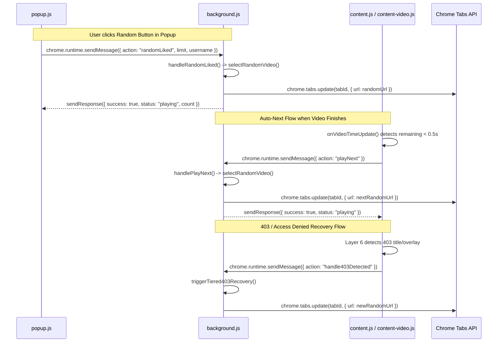
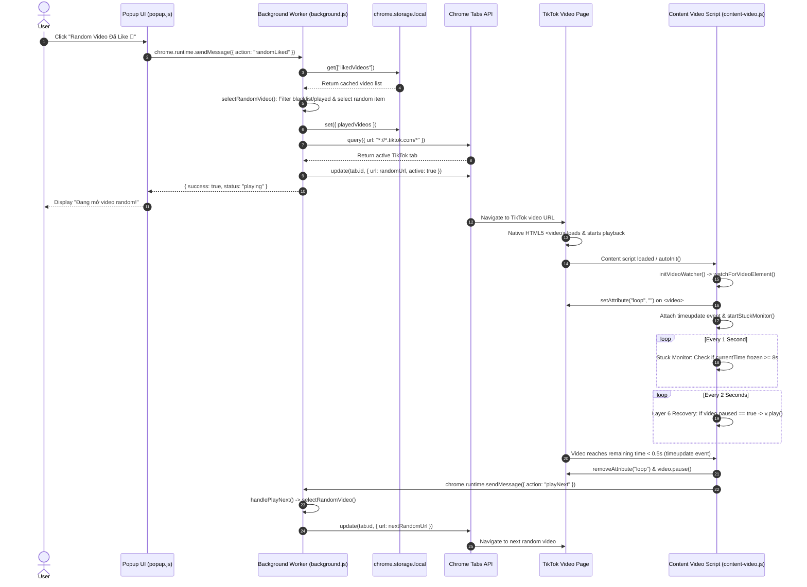

# Random TikTok Video Playback Architecture & Execution Flow

This document provides a comprehensive, function-by-function technical breakdown of how the **TikTok Random Liked** extension selects a random video, navigates the browser, monitors video state, and controls video playback.

---

## 1. High-Level Execution Flow

```text
[Popup UI] User clicks "Random Video Đã Like 🎲"
  │
  ▼ (chrome.runtime.sendMessage: { action: "randomLiked" })
[Background Service Worker] background.js
  │
  ├── chrome.storage.local.get(["likedVideos", "playedVideos", "blacklistedVideos"])
  ├── selectRandomVideo(): Filter blacklisted & played videos, pick random item
  └── getOrCreateTikTokTab(randomUrl): Find/create tab & update URL
        │
        ▼ (chrome.tabs.update: { url: randomUrl })
[Chrome Browser] Navigates tab to https://www.tiktok.com/@user/video/123456...
  │
  ▼
[TikTok Web Player] Page loads & native HTML5 <video> begins playing
  │
  ▼
[Content Scripts] content.js / js/content-video.js
  ├── Layer 1-5: Bypass visibility, focus, bot detection telemetry
  ├── Layer 6: initPlaybackRecovery() -> periodic v.play() check
  └── initVideoWatcher() -> watchForVideoElement()
        ├── Attach loop attribute (prevent feed auto-advance)
        ├── Attach timeupdate listener (detect video end < 0.5s)
        ├── startStuckMonitor(): 6-second freeze watchdog (soft recovery at 5s)
        └── checkVideoAudioAndShop(): Auto-skip muted or shop videos
              │
              ▼ (Video reaches end or triggers auto-next)
[Content Script] requestNextVideo()
  │
  ▼ (chrome.runtime.sendMessage: { action: "playNext" })
[Background Service Worker] handlePlayNext() -> selectRandomVideo() -> chrome.tabs.update()
```

---

## 2. Function-by-Function Call Flow

The execution order of all functions involved in the random playback process:

| Order | File Path | Function Name | Purpose | Called By | Calls To |
|:---|:---|:---|:---|:---|:---|
| 1 | [popup.js](file:///d:/A.Myself/Random-Video/popup.js) | `randomBtn.click` Event Listener | Handles UI click, validates input, calls background | User click on `#randomBtn` | `sendMsg({ action: "randomLiked" })`, `startProgressPoller()`, `setLoading()` |
| 2 | [popup.js](file:///d:/A.Myself/Random-Video/popup.js) | `sendMsg(data)` | Wraps `chrome.runtime.sendMessage` in a Promise | `randomBtn.click`, `skipBtn.click`, `banBtn.click` | `chrome.runtime.sendMessage()` |
| 3 | [background.js](file:///d:/A.Myself/Random-Video/background.js) | `chrome.runtime.onMessage` Listener | Main message router in Service Worker | Chrome Runtime Message Event | `handleRandomLiked()`, `sendResponse()` |
| 4 | [background.js](file:///d:/A.Myself/Random-Video/background.js) | `handleRandomLiked(limit, username)` | Manages cache lookup and triggers video navigation | `chrome.runtime.onMessage`, `is403OrErrorTab` recovery | `chrome.storage.local.get()`, `selectRandomVideo()`, `getUrl()`, `getOrCreateTikTokTab()` |
| 5 | [background.js](file:///d:/A.Myself/Random-Video/background.js) | `selectRandomVideo(excludeUrl)` | Randomly selects an unplayed, non-blacklisted video | `handleRandomLiked()`, `handlePlayNext()`, `handleSkipAndPlayNext()` | `chrome.storage.local.get()`, `chrome.storage.local.set()`, `getUrl()` |
| 6 | [background.js](file:///d:/A.Myself/Random-Video/background.js) | `getUrl(item)` | Helper to extract clean video URL from object/string | `selectRandomVideo()`, `handleRandomLiked()`, `handlePlayNext()` | N/A (Utility function) |
| 7 | [background.js](file:///d:/A.Myself/Random-Video/background.js) | `getOrCreateTikTokTab(targetUrl)` | Finds active/existing TikTok tab in any window and updates URL | `handleRandomLiked()`, `handleCollectMore()`, `handleCollectAndPlay()` | `chrome.tabs.query()`, `chrome.tabs.update()`, `chrome.tabs.create()` |
| 8 | [content.js](file:///d:/A.Myself/Random-Video/content.js) | `autoInit()` | Initializes content script when document load completes | Window `load` event / `document.readyState` check | `initVideoWatcher()` |
| 9 | [content.js](file:///d:/A.Myself/Random-Video/content.js) | `urlObserver` (MutationObserver) | Detects Single-Page Application (SPA) URL changes | DOM mutations on `document.body` | `initVideoWatcher()` |
| 10 | [js/content-video.js](file:///d:/A.Myself/Random-Video/js/content-video.js) | `initVideoWatcher()` | Verifies `/video/` page state & auto-next setting | `autoInit()`, `urlObserver`, `chrome.runtime.onMessage` (`setAutoNext`) | `chrome.storage.local.get()`, `watchForVideoElement()` |
| 11 | [js/content-video.js](file:///d:/A.Myself/Random-Video/js/content-video.js) | `watchForVideoElement()` | Finds largest video element, binds events & sets `loop` | `initVideoWatcher()`, DOM observer | `startStuckMonitor()`, `checkVideoAudioAndShop()`, `onVideoTimeUpdate()`, `onVideoEnded()` |
| 12 | [js/content-video.js](file:///d:/A.Myself/Random-Video/js/content-video.js) | `initPlaybackRecovery()` | Layer 6 watchdog: forces playback if paused & handles 403 | IIFE executed on content script load | `setInterval()`, `v.play()`, `showToast()`, `chrome.runtime.sendMessage()` |
| 13 | [js/content-video.js](file:///d:/A.Myself/Random-Video/js/content-video.js) | `startStuckMonitor()` | Monitors `currentTime` to detect 6-second video freeze (soft recovery at 5s) | `watchForVideoElement()` | `setInterval()`, `requestNextVideo()` |
| 14 | [js/content-video.js](file:///d:/A.Myself/Random-Video/js/content-video.js) | `checkVideoAudioAndShop()` | Inspects DOM for TikTok shop or muted audio keywords | `watchForVideoElement()` (via `setTimeout`) | `requestNextVideo()` |
| 15 | [js/content-video.js](file:///d:/A.Myself/Random-Video/js/content-video.js) | `onVideoTimeUpdate()` | Primary video completion detector (remaining time < 0.5s) | Video `timeupdate` Event Listener | `requestNextVideo()`, `video.pause()` |
| 16 | [js/content-video.js](file:///d:/A.Myself/Random-Video/js/content-video.js) | `requestNextVideo()` | Requests background script to navigate to next random video | `onVideoTimeUpdate()`, `onVideoEnded()`, `startStuckMonitor()` | `chrome.runtime.sendMessage({ action: "playNext" })` |
| 17 | [background.js](file:///d:/A.Myself/Random-Video/background.js) | `handlePlayNext(tabId)` | Background handler for auto-next playback request | `chrome.runtime.onMessage` (`playNext`) | `selectRandomVideo()`, `chrome.tabs.update()` |

---

## 3. Navigation Logic

All navigation to TikTok video URLs is executed **exclusively by the Extension Service Worker (`background.js`)** using Chrome Extensions Tabs API (`chrome.tabs.update` and `chrome.tabs.create`).

Content scripts do **not** use `location.href`, `location.assign()`, or `history.pushState()` for random video switching.

### Code Snippet: `getOrCreateTikTokTab(targetUrl)`

**File:** [background.js](file:///d:/A.Myself/Random-Video/background.js#L122-L145)

```javascript
async function getOrCreateTikTokTab(targetUrl) {
    // Search ALL windows (not just lastFocusedWindow) so popup opening doesn't hide TikTok tabs
    const allTikTokTabs = await chrome.tabs.query({ url: "*://*.tiktok.com/*" });

    // Prefer the already-active tab if it's TikTok
    const activeTabs = await chrome.tabs.query({ active: true });
    const activeTikTok = activeTabs.find(t => t.url && t.url.includes("tiktok.com"));
    if (activeTikTok) {
        if (targetUrl) {
            await chrome.tabs.update(activeTikTok.id, { url: targetUrl, active: true });
        }
        return activeTikTok;
    }

    if (allTikTokTabs.length > 0) {
        const targetTab = allTikTokTabs[0];
        await chrome.tabs.update(targetTab.id, { active: true });
        if (targetUrl) {
            await chrome.tabs.update(targetTab.id, { url: targetUrl });
        }
        return targetTab;
    }

    return await chrome.tabs.create({ url: targetUrl || "https://www.tiktok.com", active: true });
}
```

### Explanation of Navigation Steps:
1. `chrome.tabs.query({ active: true })` checks if the currently active tab is on `tiktok.com`.
2. If an active TikTok tab exists, `chrome.tabs.update(activeTikTok.id, { url: targetUrl, active: true })` navigates that tab directly to the selected random video URL (`https://www.tiktok.com/@user/video/123456...`).
3. If no active TikTok tab exists, it queries all open windows for any existing tab matching `*://*.tiktok.com/*` and updates it.
4. If no TikTok tab exists anywhere in browser, `chrome.tabs.create({ url: targetUrl, active: true })` opens a new tab.

---

## 4. Playback Logic & Execution Triggers

Video playback relies on a combination of **TikTok's native HTML5 video player autoplay** and **Layer 6 forced playback recovery** inside content scripts.

### 4.1 Native HTML5 Video Autoplay
When Chrome navigates to a `/video/` URL on TikTok, TikTok's web application initializes its HTML5 `<video>` player and starts playback automatically.

### 4.2 Layer 6 Forced Playback Recovery

**File:** [js/content-video.js](file:///d:/A.Myself/Random-Video/js/content-video.js#L260-L277)

```javascript
(function initPlaybackRecovery() {
    console.log("[CS] Layer 6 Playback & Error Recovery initialized.");

    setInterval(function () {
        if (!window.location.href.includes("/video/")) return;

        var videos = document.querySelectorAll("video");
        for (var i = 0; i < videos.length; i++) {
            var v = videos[i];
            if (v.paused && v.src && v.duration && v.duration > 0 && !v.ended) {
                console.log("[CS] ⚠️ Phát hiện video bị pause hoặc load chậm");
                v.play().catch(function () { });
            }
        }
    }, 2000);
    // ...
})();
```

#### Conditions required before Layer 6 forces `v.play()`:
1. Current page URL must contain `"/video/"`.
2. `<video>` element must exist in DOM (`document.querySelectorAll("video")`).
3. Video is currently `paused` (`v.paused === true`).
4. Video has valid source (`v.src`), valid duration (`v.duration > 0`), and has not ended (`!v.ended`).

---

## 5. Event Flow & Monitoring

The extension listens to and manipulates specific browser and HTML5 Media events:

```
┌─────────────────────────────────────────────────────────────────────────────┐
│                          EVENT FLOW SUMMARY                                 │
├───────────────────────┬──────────────────────┬──────────────────────────────┤
│ Event Name            │ Target / Source      │ Action Taken by Extension    │
├───────────────────────┼──────────────────────┼──────────────────────────────┤
│ timeupdate            │ HTML5 <video>        │ Primary trigger: if remaining│
│                       │                      │ time < 0.5s -> playNext      │
│ ended                 │ HTML5 <video>        │ Safety net trigger for       │
│                       │                      │ playNext                     │
│ visibilitychange      │ document / window    │ INTERCEPTED & BLOCKED by     │
│                       │                      │ Layer 1 anti-detection       │
│ blur                  │ window / document    │ INTERCEPTED & BLOCKED by     │
│                       │                      │ Layer 2 anti-detection       │
│ focus                 │ window / document    │ PERIODICALLY DISPATCHED by   │
│                       │                      │ Layer 2                      │
│ chrome.tabs.onUpdated │ Chrome Tabs API      │ Listened by background.js to │
│                       │                      │ detect 403 / Access Denied   │
│ chrome.commands       │ Chrome Keyboard API  │ Triggers Ctrl+Shift+9 shortcut│
│ MutationObserver      │ DOM document.body    │ Detects SPA URL changes &    │
│                       │                      │ enforces video loop attribute│
└───────────────────────┴──────────────────────┴──────────────────────────────┘
```

### Event Details:

1. **`timeupdate`** ([js/content-video.js](file:///d:/A.Myself/Random-Video/js/content-video.js#L554-L576)):
   - **Primary completion detector.** Because the extension forces `loop` on the `<video>` element to prevent TikTok from auto-advancing to its recommendation feed, `ended` event does not naturally fire.
   - When `video.duration - video.currentTime < 0.5`, the content script removes `loop`, pauses the video, and sends `playNext` to `background.js`.

2. **`ended`** ([js/content-video.js](file:///d:/A.Myself/Random-Video/js/content-video.js#L546-L551)):
   - **Safety net.** Fires if the `loop` attribute was removed by TikTok script before completion.

3. **`visibilitychange` & `blur`** ([js/content-video.js](file:///d:/A.Myself/Random-Video/js/content-video.js#L18-L53)):
   - Intercepted in capture phase with `stopImmediatePropagation()` so TikTok cannot pause video playback or flag automation when the user switches browser tabs.

4. **`chrome.tabs.onUpdated`** ([background.js](file:///d:/A.Myself/Random-Video/background.js#L646-L661)):
   - Background service worker checks `tab.title` for 403 / Access Denied / Forbidden / Error pages and auto-recovers by picking a new random video.

---

## 6. Message Passing Architecture



---

## 7. Asynchronous Execution Mechanisms

| Mechanism | Location | Role in Playback Flow |
|:---|:---|:---|
| `async / await` | `background.js` (`handleRandomLiked`, `selectRandomVideo`, `getOrCreateTikTokTab`) | Handles asynchronous Chrome extension API calls (`chrome.storage.local.get`, `chrome.tabs.query`, `chrome.tabs.update`). |
| `Promise` | `popup.js` (`sendMsg`), `background.js` (`randomDelay`) | Wraps message passing and provides randomized human-like delay between video transitions. |
| `setTimeout` | `js/content-video.js` (`checkVideoAudioAndShop`, `showToast`, `requestNextVideo`) | Delays execution for audio/shop checks (2.5s) to allow video metadata and DOM elements to load. |
| `setInterval` | `background.js` (Watchdog poller), `js/content-video.js` (Layer 4, 5, 6, `startStuckMonitor`) | 1. Layer 6 periodic playback check (every 1.5s).<br>2. Stuck monitor checking `currentTime` freeze (every 1s).<br>3. Background 403 watchdog check (every 3s). |
| `MutationObserver` | `content.js` (`urlObserver`), `js/content-video.js` (`loopObserver`) | 1. `urlObserver` monitors `document.body` for Single-Page Application (SPA) URL changes.<br>2. `loopObserver` monitors `<video>` attribute changes to re-add `loop` if TikTok attempts to remove it. |

---

## 8. Playback Timing Breakdown

```text
[Chrome Tab Navigation: chrome.tabs.update]
  │
  ▼ (~500ms - 1500ms: Network & Page Navigation)
[TikTok Page Loaded / DOM Ready]
  │
  ▼ (Immediate: Native TikTok Player starts buffering & playback)
[Content Script Injected / autoInit()]
  │
  ├── 0ms: urlObserver detects /video/ URL & calls initVideoWatcher()
  ├── 1500ms: Layer 6 initPlaybackRecovery() runs first check:
  │           If video.paused == true -> executes v.play().catch()
  └── 2500ms: checkVideoAudioAndShop() executes:
              - If shop video detected -> triggers requestNextVideo()
              - If muted video detected -> triggers requestNextVideo()
```

---

## 9. Sequence Diagram



---

## 10. Related Source Files & Responsibilities

| File Path | Primary Responsibility | Key Functions Involved in Playback |
|:---|:---|:---|
| [popup.html](file:///d:/A.Myself/Random-Video/popup.html) | User interface popup panel containing Random, Skip, Ban, Backup buttons. | `#randomBtn`, `#skipBtn`, `#banBtn` |
| [popup.js](file:///d:/A.Myself/Random-Video/popup.js) | Handles user button clicks, input validation, progress poller, and sends messages to background. | `randomBtn.addEventListener("click")`, `sendMsg()`, `startProgressPoller()` |
| [background.js](file:///d:/A.Myself/Random-Video/background.js) | Service worker managing extension state, storage, random video selection, tab navigation, and 403 watchdog. | `handleRandomLiked()`, `selectRandomVideo()`, `getOrCreateTikTokTab()`, `handlePlayNext()`, `is403OrErrorTab()` |
| [content.js](file:///d:/A.Myself/Random-Video/content.js) | Content script entry point, SPA URL navigation observer, and background message listener. | `autoInit()`, `urlObserver`, `chrome.runtime.onMessage` listener |
| [js/content-video.js](file:///d:/A.Myself/Random-Video/js/content-video.js) | Video watcher engine, auto-next timer, loop attribute enforcement, 8s stuck monitor, shop/audio filter, and Layer 1-6 anti-detection bypasses. | `initVideoWatcher()`, `watchForVideoElement()`, `onVideoTimeUpdate()`, `requestNextVideo()`, `startStuckMonitor()`, `initPlaybackRecovery()` |
| [js/selectors.js](file:///d:/A.Myself/Random-Video/js/selectors.js) | DOM selector definitions, muted sound keywords, and global content script state declarations. | `TK_SELECTORS`, `MUTED_SOUND_KEYWORDS` |
| [manifest.json](file:///d:/A.Myself/Random-Video/manifest.json) | Extension Manifest V3 configuration, permissions (`tabs`, `storage`, `scripting`), background service worker, and content script registration. | `permissions`, `background`, `content_scripts` |
